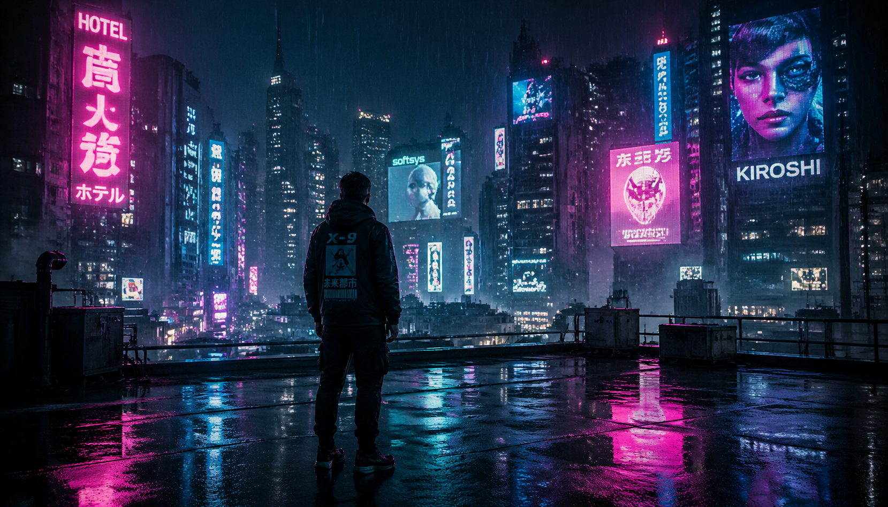
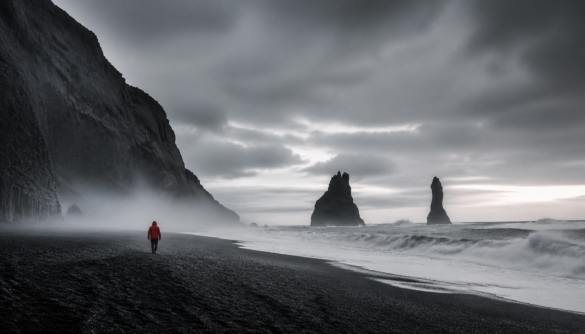
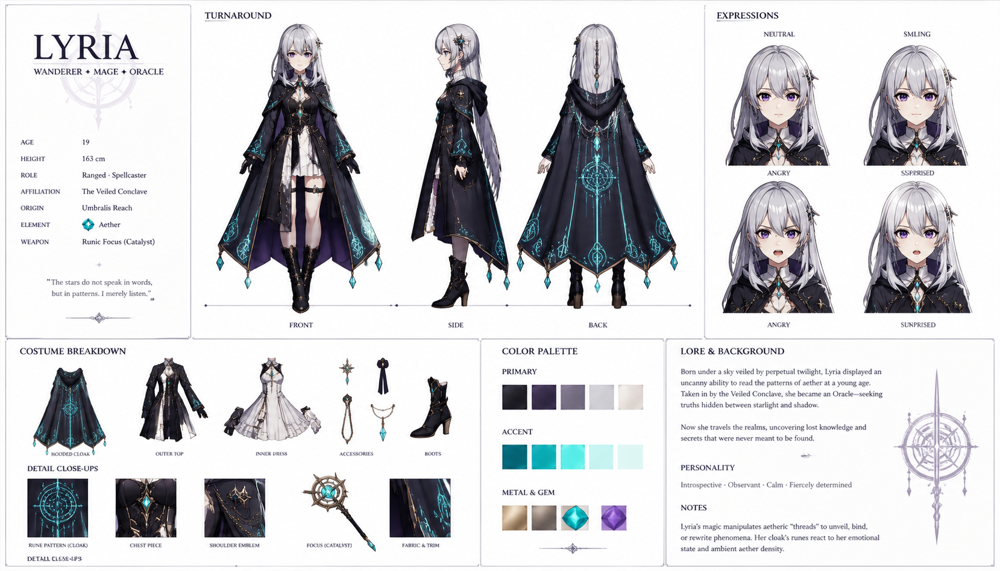
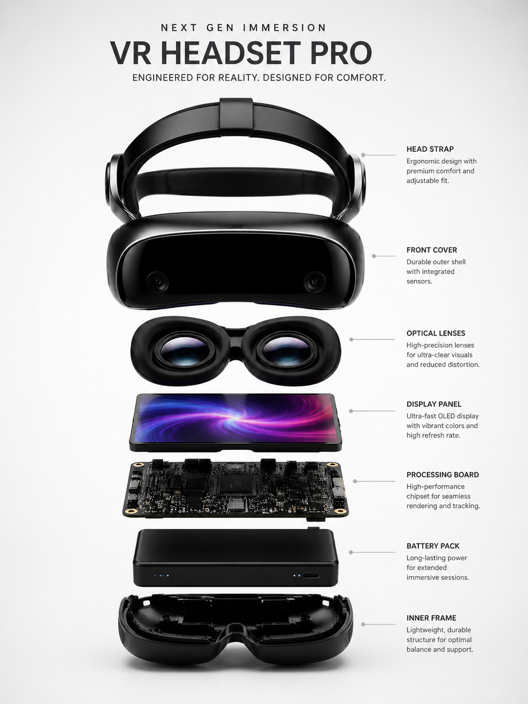

<h1>Awesome GPT Image 2 プロンプト集</h1>

  
  
  

<b>世界最大の厳選GPT Image 2プロンプトコレクション。</b> 
クリエイター、マーケター、デザイナーのために厳選、テスト、整理されています。

  <a href="README.md">English</a> |
  <a href="README_zh.md">中文</a> |
  <b>日本語</b> |
  <a href="README_ko.md">한국어</a> |
  <a href="README_es.md">Español</a> |
  <a href="README_fr.md">Français</a> |
  <a href="README_de.md">Deutsch</a>

---

## クイックリンク

| カテゴリ | プロンプト数 | NeoSparkで試す |
|----------|-------------|----------------|
| [シネマ & 映画](#シネマ--映画) | 12 | [生成](https://platform.useneospark.com/) |
| [ポートレート & ビューティ](#ポートレート--ビューティ) | 10 | [生成](https://platform.useneospark.com/) |
| [プロダクト写真](#プロダクト写真) | 8 | [生成](https://platform.useneospark.com/) |
| [UI & アプリデザイン](#ui--アプリデザイン) | 8 | [生成](https://platform.useneospark.com/) |
| [ファンタジー & アニメ](#ファンタジー--アニメ) | 10 | [生成](https://platform.useneospark.com/) |
| [自然 & 風景](#自然--風景) | 10 | [生成](https://platform.useneospark.com/) |
| [マーケティング & SNS](#マーケティング--sns) | 8 | [生成](https://platform.useneospark.com/) |
| [タイポグラフィ & ポスター](#タイポグラフィ--ポスター) | 6 | [生成](https://platform.useneospark.com/) |
| [建築 & インテリア](#建築--インテリア) | 6 | [生成](https://platform.useneospark.com/) |
| [実験 & 楽しい](#実験--楽しい) | 6 | [生成](https://platform.useneospark.com/) |

**合計: 84+ 本番用プロンプト** — [NeoSparkで完全ライブラリを閲覧](https://useneospark.com/prompt-lib?ref=awesome-gpt-image-2)

---

## GPT Image 2とは？

**GPT Image 2**はOpenAIの最新画像生成モデルで、ChatGPTのネイティブ画像作成機能を提供しています。

- **写真級の品質** — 正確な解剖学、照明、テクスチャ
- **完璧なテキストレンダリング** — 引用、サイン、UIラベルが鮮明で読みやすい
- **スタイルの一貫性** — 会話内の複数画像で統一されたスタイル
- **高度な編集** — 自然言語で既存の画像を修正
- **マルチモーダル理解** — 以前のメッセージの文脈を理解

> ChatGPT PlusなしでGPT Image 2を試したい？[NeoSparkはすべてのプランにGPT Image 2を含む](https://useneospark.com/pricing?ref=awesome-gpt-image-2) — 追加料金なし、即時アクセス。

---

## 注目のプロンプト

### 1. サイバーパンク東京ルーフトップ

> 映画のようなワイドショット。黒いテックウェアジャケットを着た孤独な人物が、真夜中の雨に濡れた東京の屋上に立っている。ピンク、シアン、エレクトリックブルーのネオンサインが水たまりに反射している。遠くの高層ビルの間にホログラフィック広告が浮かんでいる。光る雨が筋として捉えられている。アナモルフィックレンズ、2.39:1ワイドスクリーン、フィルムグレイン、ティールの影とマゼンタのハイライト。ブレードランナー2049の美学。

  

[**NeoSparkでこのプロンプトを試す →**](https://useneospark.com/prompt-lib?prompt=cyberpunk-tokyo&ref=awesome-gpt-image-2)

### 2. プロフェッショナルLinkedInヘッドショット

> 30代前半で、自信に満ちた女性のプロフェッショナルなミディアムショットのポートレート。ネイビーブルーのテーラードブレザーとクリーム色のシルクブラウスを着用。ニュートラルグレーのスタジオ背景。ソフトな3点照明。85mmレンズ、f/2.8で撮影。目に鋭い焦点、浅い被写界深度。自然な肌のテクスチャ、見える毛穴、美容フィルターなし。

  

[**NeoSparkでこのプロンプトを試す →**](https://useneospark.com/prompt-lib?prompt=linkedin-headshot&ref=awesome-gpt-image-2)

### 3. アイソメトリック3Dワークスペース

> 45度アイソメトリックミニチュア3Dシーン。ライトウッドのディスプレイベースに置かれた、モダンなデザイナーのワークスペースのジオラマ。スリークなiMac、ワイヤレスキーボード、モンステラの鉢植え、コーヒーカップ、デザイン本が整然と配置されている。ソフトなPBRテクスチャ、リアルなマテリアル。セージグリーンとウォームクリームのパステルカラーパレット。

  

[**NeoSparkでこのプロンプトを試す →**](https://useneospark.com/prompt-lib?prompt=isometric-workspace&ref=awesome-gpt-image-2)

### 4. アイスランド黒砂ビーチ

> アイスランドのレイニスフィヤラ黒砂ビーチの劇的なワイド風景。北大西洋からそびえる巨大な玄武岩の海食柱。黒い火山砂を横切る低い霧。海岸線を歩く真っ赤なレインジャケットを着た孤独な人物。ムーディーな低彩度カラーグレーディング。24mmワイドレンズ、f/11。ウルトラディテール4K、ナショナルジオグラフィック品質。

  

[**NeoSparkでこのプロンプトを試す →**](https://useneospark.com/prompt-lib?prompt=iceland-beach&ref=awesome-gpt-image-2)

### 5. ファンタジーRPGキャラクターシート

> オリジナルのファンタジーRPGキャラクターのプロフェッショナルなキャラクターリファレンスシート。銀白色の髪と紫色の目を持つ若い女性メイジ。暗いクロークに光るティールのルーンパターン。クリーンな白い背景に：フロント、サイド、バックの3ビューターンアラウンド。表情バリエーション。16:9のアスペクト比。

  

[**NeoSparkでこのプロンプトを試す →**](https://useneospark.com/prompt-lib?prompt=rpg-character-sheet&ref=awesome-gpt-image-2)

### 6. VRヘッドセット分解図ポスター

> プレミアム製品ポスター。中央に未来派的なVRヘッドセットの分解図。レンズ、ディスプレイパネル、回路基板、バッテリーパック、ヘッドストラップが完璧なアラインメントで浮遊。クリーンな白い背景。各コンポーネントに細い線とミニマルなサンセリフテキストでラベル付け。アップルレベルのプレゼンテーション品質。

  

[**NeoSparkでこのプロンプトを試す →**](https://useneospark.com/prompt-lib?prompt=vr-exploded-view&ref=awesome-gpt-image-2)

---

## シネマ & 映画

詳細なプロンプトは[英語版README](README.md#cinematic--film)をご覧ください。

主要なカテゴリ：
- フィルムノワール ファム・ファタール
- ウェス・アンダーソン ホテルロビー
- デニス・ヴィルヌーヴ 砂漠の叙事詩
- マイアミ・バイス ネオン
- イタリアン・ジャッロ ホラー
- ジブリ実写風
- 韓国犯罪スリラー
- フランス・ヌーヴェルヴァーグ カフェ
- ジャズバー interior
- アクションフィギュア ブリスターパック
- レトロ端末スクリーン
- サイレント映画 宇宙飛行士

---

## ポートレート & ビューティ

詳細なプロンプトは[英語版README](README.md#portraits--beauty)をご覧ください。

主要なカテゴリ：
- エクストリームクローズアップ ビューティー
- ラグジュアリー エディトリアルポートレート
- 環境ストリートポートレート
- ハイファッション Vogueカバー
- ソフトナチュラルライトポートレート
- ドラマチック モノクローム
- ドリーミー パステルビューティー
- ゴールデンアワー ポートレート
- ダークアカデミア
- コーポレート ヘッドショット

---

## プロンプトエンジニアリングのヒント

### 8スロット公式

1. **主題** — メインフォーカスは何か？
2. **アクション/ポーズ** — 何をしているか？
3. **環境** — どこにいるか？
4. **照明** — どのように照らされているか？
5. **カメラ/レンズ** — どの機材を使用？
6. **スタイル/参照** — どの美学？
7. **カラーグレード** — どのパレット？
8. **雰囲気** — どのような感じ？

### テキスト精度の向上

- テキストを**引用符**で囲む: `"OPEN LATE"`
- **フォントスタイル**を指定: "bold sans-serif"
- **配置**を説明: "top center"
- **強調には全大文字**: `"DREAM BIG"`

---

## NeoSparkについて

### AIエージェント駆動のクリエイティブチーム

[NeoSpark](https://useneospark.com?ref=awesome-gpt-image-2)は、1つのプラットフォームで**GPT Image 2**と7以上のトップAIモデルに即時アクセスできます：

- **テキストtoデザイン** — アイデアから素材へワンクリック
- **スマートカラーズ** — AI駆動の色彩心理学
- **eコマースソリューション** — 商品写真と広告動画
- **動画生成** — Veo 3、Seedance 2.0など
- **全モデル含む** — 追加料金なし、即時切り替え

**[初回無料デザインを試す →](https://useneospark.com?ref=awesome-gpt-image-2)**

*クレジットカード不要 • 2,500人以上のクリエイターが使用中*

---

## ライセンス

このリポジトリは[CC BY 4.0](https://creativecommons.org/licenses/by/4.0/)ライセンスの下で提供されています。

---

このコレクションが役に立ったら、<a href="https://useneospark.com?ref=awesome-gpt-image-2">NeoSparkを試してみて</a>、このリポジトリをシェアしてください！

  <a href="https://useneospark.com/prompt-lib?ref=awesome-gpt-image-2">プロンプトライブラリ</a> •
  <a href="https://useneospark.com/pricing?ref=awesome-gpt-image-2">料金</a> •
  <a href="https://useneospark.com/blog?ref=awesome-gpt-image-2">ブログ</a>

