<div align="center">

<a href="https://www.youtube.com/watch?v=ylZYhEdoCaw" target="_blank">
  
</a>

<h1>Awesome GPT Image 2 提示词合集</h1>

<p>
  <a href="https://github.com/sindresorhus/awesome"></a>
  
  
  
</p>

<p><b>全球最大的 GPT Image 2 提示词精选合集。</b><br>
为创作者、营销人员和设计师精心挑选、测试和整理。</p>

<p>
  <a href="README.md">English</a> |
  <b>中文</b> |
  <a href="README_ja.md">日本語</a> |
  <a href="README_ko.md">한국어</a> |
  <a href="README_es.md">Español</a> |
  <a href="README_fr.md">Français</a> |
  <a href="README_de.md">Deutsch</a>
</p>

</div>

---

## 快速导航

| 分类 | 提示词数量 | 在 NeoSpark 试用 |
|------|-----------|-----------------|
| [电影与镜头](#电影与镜头) | 12 | [生成](https://platform.useneospark.com/) |
| [人像与美妆](#人像与美妆) | 10 | [生成](https://platform.useneospark.com/) |
| [产品摄影](#产品摄影) | 8 | [生成](https://platform.useneospark.com/) |
| [UI与应用设计](#ui与应用设计) | 8 | [生成](https://platform.useneospark.com/) |
| [奇幻与动漫](#奇幻与动漫) | 10 | [生成](https://platform.useneospark.com/) |
| [自然与风景](#自然与风景) | 10 | [生成](https://platform.useneospark.com/) |
| [营销与社媒](#营销与社媒) | 8 | [生成](https://platform.useneospark.com/) |
| [排版与海报](#排版与海报) | 6 | [生成](https://platform.useneospark.com/) |
| [建筑与室内](#建筑与室内) | 6 | [生成](https://platform.useneospark.com/) |
| [实验与趣味](#实验与趣味) | 6 | [生成](https://platform.useneospark.com/) |

**总计：84+ 生产级提示词** — [在 NeoSpark 浏览完整库](https://useneospark.com/prompt-lib?ref=awesome-gpt-image-2)

---

## 什么是 GPT Image 2？

**GPT Image 2** 是 OpenAI 最新的图像生成模型，为 ChatGPT 提供原生图像创建能力。它具备：

- **照片级真实感** — 精准的解剖结构、光影和纹理
- **完美的文字渲染** — 引用、标识、UI 标签清晰可读
- **风格一致性** — 对话中多图风格统一
- **高级编辑** — 用自然语言修改现有图像
- **多模态理解** — 理解前文上下文
- **更快的生成速度** — 改进的连贯性

> 想在不用 ChatGPT Plus 的情况下体验 GPT Image 2？**[NeoSpark 每个套餐都包含 GPT Image 2](https://useneospark.com/pricing?ref=awesome-gpt-image-2)** — 无额外费用，即时访问。

---

## 目录

- [精选提示词](#精选提示词)
- [电影与镜头](#电影与镜头)
- [人像与美妆](#人像与美妆)
- [产品摄影](#产品摄影)
- [UI与应用设计](#ui与应用设计)
- [奇幻与动漫](#奇幻与动漫)
- [自然与风景](#自然与风景)
- [营销与社媒](#营销与社媒)
- [排版与海报](#排版与海报)
- [建筑与室内](#建筑与室内)
- [实验与趣味](#实验与趣味)
- [提示工程技巧](#提示工程技巧)
- [如何贡献](#如何贡献)
- [许可证](#许可证)

---

## 精选提示词

### 1. VR 头显分解图海报

> 一张高端产品海报，纵向 3:4 构图。中心：一副未来感 VR 头显的分解图，每个组件在完美的对齐中悬浮 —— 镜片、显示面板、电路板、电池组、头带。干净的白色背景配微妙渐变。每个组件用细线和极简无衬线字体标注。柔和的顶部工作室灯光，每个部件下方有轻微阴影。专业产品摄影风格，超锐利细节，苹果级别的展示品质。

[**在 NeoSpark 试用此提示词 →**](https://useneospark.com/prompt-lib?prompt=vr-exploded-view&ref=awesome-gpt-image-2)

### 2. 赛博朋克东京屋顶

> 电影级广角镜头。一个身穿黑色科技风衣的孤独身影站在雨中的东京屋顶，午夜时分。日文和英文的霓虹灯招牌在水坑中反射出粉色、青色和电光蓝的色彩。远处摩天大楼之间漂浮着全息广告。光线雨丝被捕捉成条纹。变形镜头拍摄，2.39:1 宽银幕，胶片颗粒，青色阴影和洋红色高光。《银翼杀手2049》美学。

[**在 NeoSpark 试用此提示词 →**](https://useneospark.com/prompt-lib?prompt=cyberpunk-tokyo&ref=awesome-gpt-image-2)

### 3. 专业领英头像

> 专业中景人像，一位三十出头、穿着定制海军蓝西装外套和奶油色丝绸衬衫的自信女性。中性灰色工作室背景。经典三点布光：相机左侧 45 度主光，补光减 2 档，背后发丝光。85mm 镜头 f/2.8 拍摄，眼睛锐利对焦，浅景深。自然皮肤纹理，可见毛孔，无美颜滤镜。3200K 暖色温。专业又亲和的表情。

[**在 NeoSpark 试用此提示词 →**](https://useneospark.com/prompt-lib?prompt=linkedin-headshot&ref=awesome-gpt-image-2)

### 4. 等距 3D 工作空间模型

> 45 度等距微型 3D 场景，一个现代设计师的工作空间微缩模型放在浅色木展示底座上。一台时尚的 iMac、无线键盘、龟背竹盆栽、咖啡杯和设计书籍整齐排列。柔和的 PBR 纹理，真实材质，干净统一的构图。鼠尾草绿和暖奶油色为主的柔和色调。工作室柔光箱照明，微妙的 Ambient Occlusion。方形 1:1 画幅，居中主体，大量留白。粘土渲染美学。

[**在 NeoSpark 试用此提示词 →**](https://useneospark.com/prompt-lib?prompt=isometric-workspace&ref=awesome-gpt-image-2)

### 5. 奇幻 RPG 角色表

> 一张专业的原创奇幻 RPG 角色参考表：一位年轻的女法师，银白色长发和紫色眼睛，穿着带有发光青色符文图案的华丽深色斗篷。在干净的白色背景上：三视图展示正面、侧面和背面；面部表情变化（中性、微笑、愤怒、惊讶）；服装详细分解；色板样本；简洁排版的世界观注释。整齐的网格布局，概念艺术风格，高分辨率。宽高比 16:9。

[**在 NeoSpark 试用此提示词 →**](https://useneospark.com/prompt-lib?prompt=rpg-character-sheet&ref=awesome-gpt-image-2)

### 6. 冰岛黑沙滩

> 戏剧性的冰岛 Reynisfjara 黑沙滩黎明广角风景。巨大的玄武岩石柱从汹涌的北大西洋中升起。低雾飘过黑色火山沙。一个穿着亮红色雨衣的孤独身影沿着海岸线行走作为比例参考。沉郁的去饱和色调 —— 几乎是单色，只有红色雨衣作为点缀。24mm 广角镜头，f/11 深景深。超精细 4K，国家地理品质。

[**在 NeoSpark 试用此提示词 →**](https://useneospark.com/prompt-lib?prompt=iceland-beach&ref=awesome-gpt-image-2)

---

## 电影与镜头

### 黑色电影蛇蝎美人

> 黑色电影镜头。一位危险美丽的蛇蝎美人穿着贴身红色丝绸连衣裙，站在凌晨 2 点香港雨中的小巷里。青红相间的霓虹灯招牌在湿漉漉的鹅卵石上反射。她手持香烟，烟雾袅袅上升。35mm 胶片拍摄，50mm 镜头 f/1.4，浅景深。深邃的阴影，高对比度，忧郁氛围。电影级调色，青色阴影和暖红色高光。


<p align="center">
  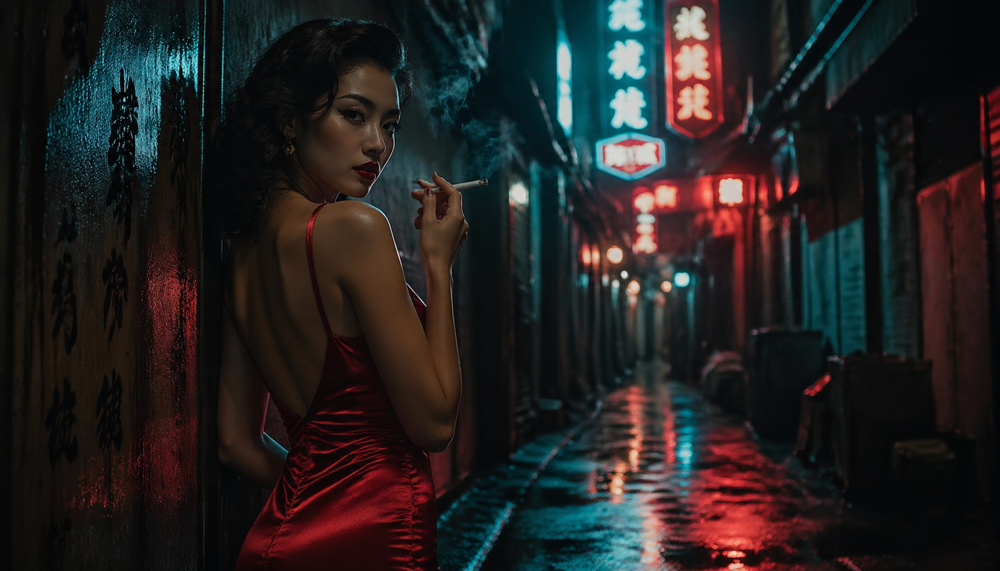
</p>

### 韦斯·安德森酒店大堂

> 韦斯·安德森风格的电影构图。一位 1960 年代穿着酒红色制服的酒店礼宾员站在完美对称的装饰艺术大堂正中央。粉色墙壁、金色几何图案、黑白格子大理石地板。入口两侧各有一辆行李车。均匀、平光照明。35mm 胶片拍摄，轻微暗角。古怪、一丝不苟的构图。


<p align="center">
  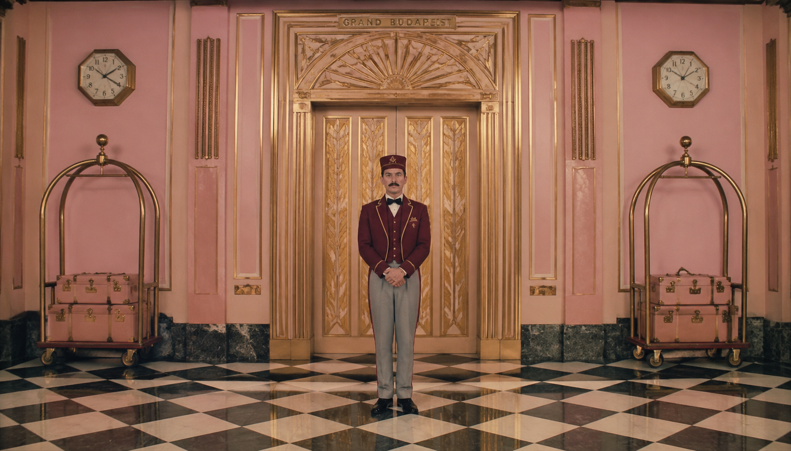
</p>

### 丹尼斯·维伦纽瓦沙漠史诗

> 丹尼斯·维伦纽瓦风格的史诗级广角镜头。一个身披飘逸沙漠长袍的孤独兜帽身影走过广阔的橙色沙丘，在灼热的夕阳下。极端的比例 —— 身影在景观面前显得渺小。金色光线中的尘埃颗粒。65mm 胶片拍摄，18mm 超广角镜头。自然胶片颗粒，无 CGI 平滑感。《沙丘》(2021) 色调。


<p align="center">
  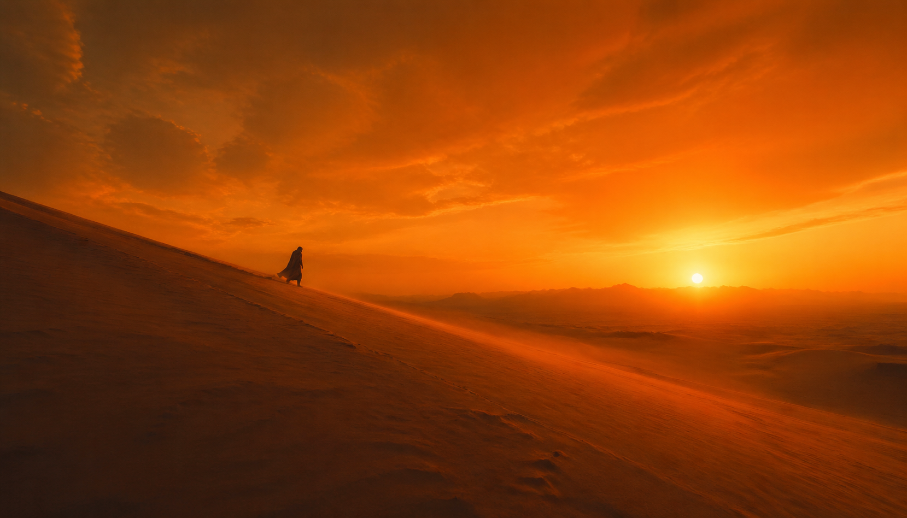
</p>

### 迈阿密风云霓虹

> 1980 年代迈阿密风云电影镜头。一位身穿白色亚麻西装外套的女性驾驶红色敞篷法拉利 Testarossa 在深夜穿越迈阿密市中心。棕榈树和霓虹汽车旅馆招牌在运动中模糊掠过。她戴着太阳镜，反射出城市的粉色和绿松石色光芒。镜头光晕，柔和胶片颗粒。青绿和洋红色调色。超真实 4K，变形镜头特性。


<p align="center">
  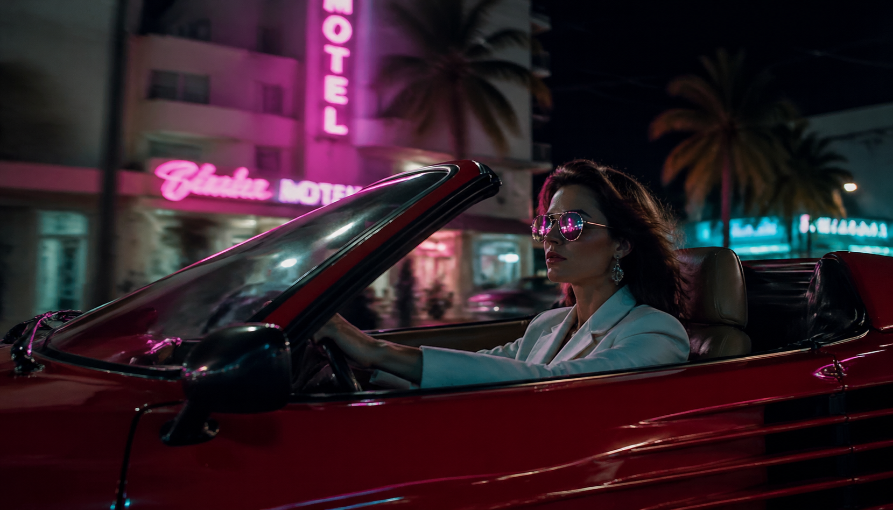
</p>

### 意大利铅黄恐怖片

> 1970 年代意大利铅黄恐怖片风格的电影恐怖画面。一位身穿白色睡袍的女性站在维多利亚式长廊尽头，只有闪烁的红色灯光照明。她背对镜头。她的影子不可思议地向镜头延伸。壁纸是深红色锦缎。浅景深，28mm 镜头轻微畸变。颗粒感胶片质感。深红与黑色的色彩故事。超精细 4K。


<p align="center">
  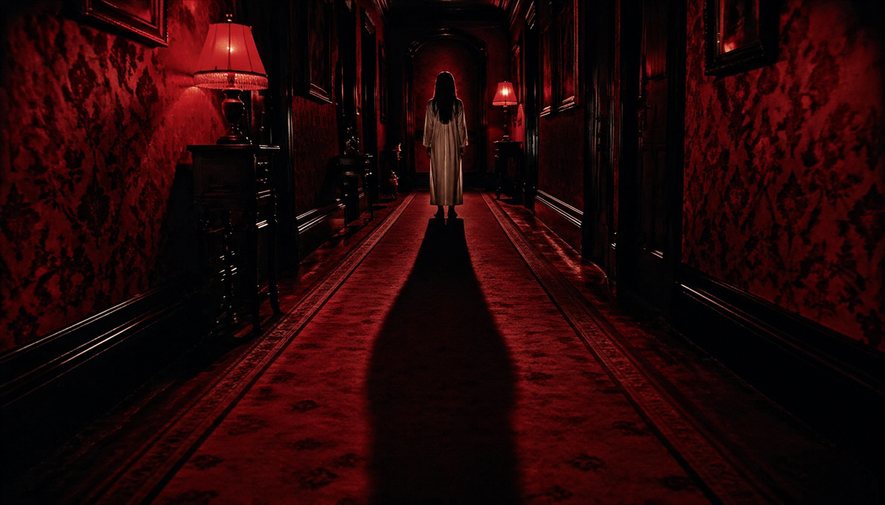
</p>

### 吉卜力真人版

> 吉卜力工作室真人版风格的电影画面。一位身穿简单蓝色亚麻连衣裙的年轻女子站在广阔的绿色山坡野花田中。微风拂动她的头发和裙摆。金色逆光在她身后形成温暖的光晕。远处的白云映衬着天蓝色天空。中画幅胶片拍摄，80mm 镜头，《哈尔的移动城堡》式画意调色。梦幻、怀旧氛围。


<p align="center">
  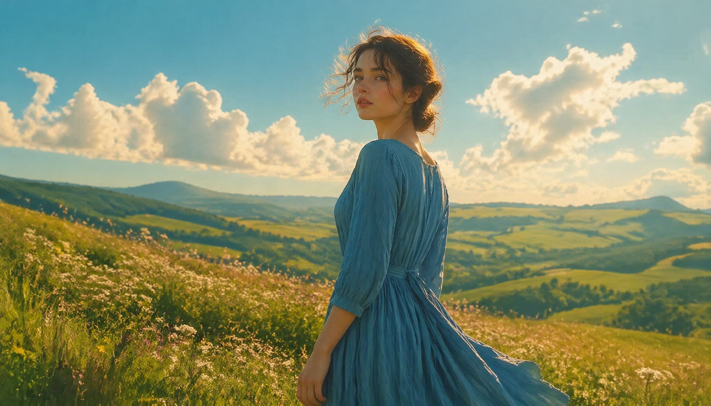
</p>

### 韩国犯罪惊悚片

> 现代韩国犯罪惊悚片的电影画面。两名男子在首尔一间小公寓厨房的桌子两端对峙。一名是穿着皱巴巴米色风衣的侦探，另一名是穿黑色高领衫的嫌疑人。头顶的荧光灯管投下刺眼的阴影。桌上有烧酒瓶和小菜。Arri Alexa 拍摄，40mm 镜头 f/2。奉俊昊式构图。紧张、幽闭的氛围。


<p align="center">
  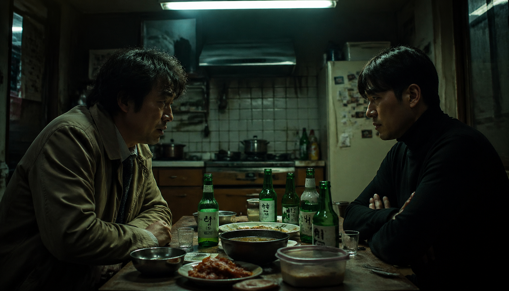
</p>

### 法国新浪潮咖啡馆

> 黑白法国新浪潮电影画面。一位身穿条纹布列塔尼衬衫、留着深色波波头的年轻女子在巴黎咖啡馆桌边抽着高卢牌香烟。她带着神秘的微笑望向镜头之外。右侧自然窗光。戈达尔美学，1962 年。35mm 胶片颗粒，略微过曝的高光。知性、忧郁的氛围。


<p align="center">
  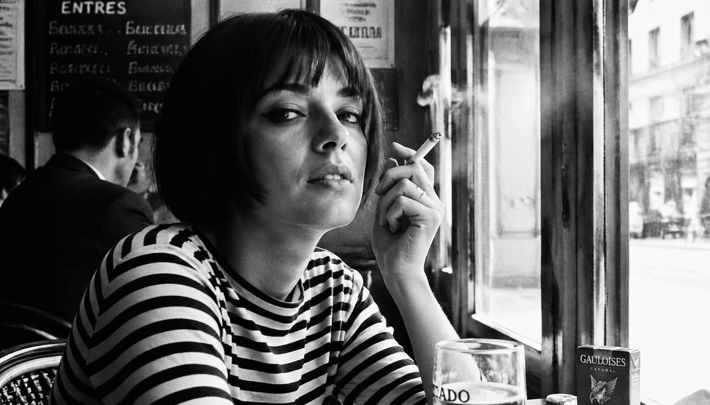
</p>

### 爵士酒吧内景

> 忧郁的爵士酒吧内景。一位身穿黑色蕾丝透视裙的神秘女子坐在天鹅绒吧台前的高脚凳上。上方单个爱迪生灯泡的伦勃朗灯光。烟雾在温暖的琥珀色光束中飘荡。背景中萨克斯手是剪影。中画幅胶片拍摄，80mm 镜头 f/2。深邃的阴影，丰富的暖色调。黑色电影氛围。


<p align="center">
  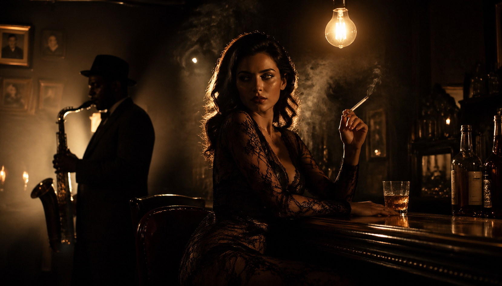
</p>

### 可动人偶开箱

> 一个赛博朋克武士风格的人偶密封在高级塑料吸塑包装中，正面拍摄。纸板背衬 glossy，顶部大标题用超大号镀铬无衬线大写字母写着 "NEON RONIN"，下方较小的标语是 "Tokyo 2087"。人偶摆出姿势，配有等离子武士刀和科技面罩。工作室产品摄影，柔和顶光，干净的灰白色背景，地板上有微妙的倒影。


<p align="center">
  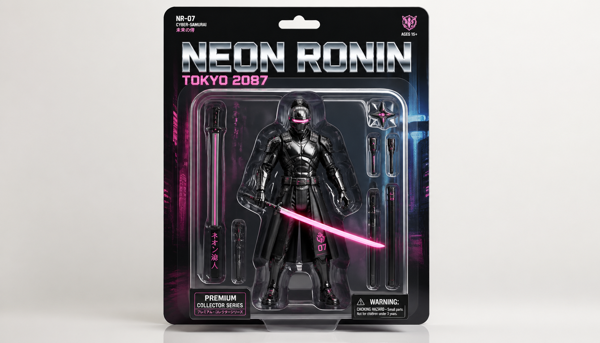
</p>
---

## 人像与美妆

### 极致特写美妆

> 极致特写美妆人像。一位惊艳的模特，湿漉漉的露珠般肌肤和蓬乱的湿发。锁骨上有水滴。环形灯拍摄，眼睛中形成完美的圆形眼神光。微距镜头，f/16 极端锐度，每根睫毛都清晰。Fenty Beauty 广告美学。干净、极简、高级时尚。


<p align="center">
  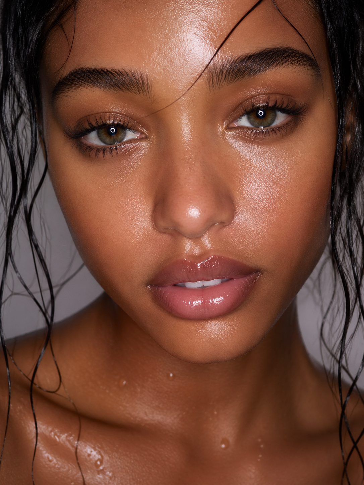
</p>

### 奢侈品编辑人像

> 奢侈品编辑人像。一位美丽的模特穿着优雅的黑色丝绒露肩礼服，斜倚在深色丝绒躺椅上。左侧巴洛克式伦勃朗灯光，右脸深邃阴影。中画幅拍摄，100mm 镜头 f/2。可见的面料纹理，光泽唇彩高光。意大利版 Vogue 美学。


<p align="center">
  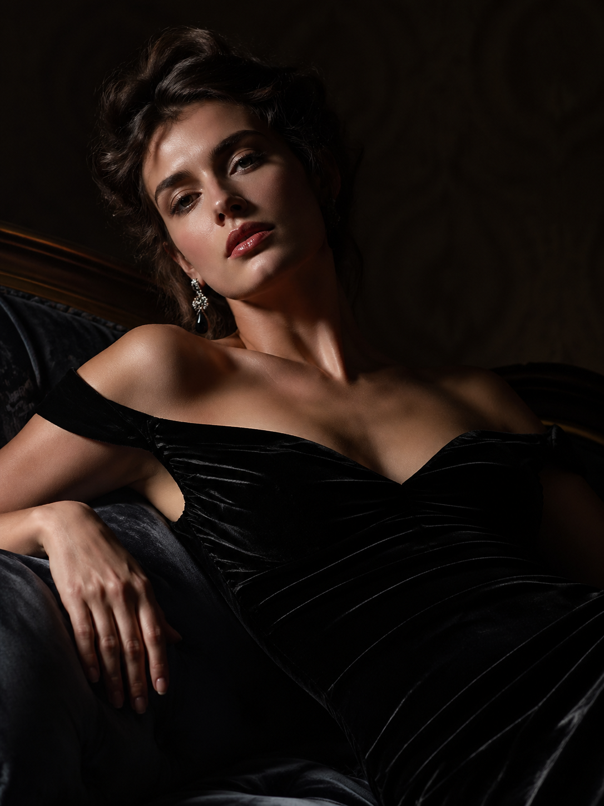
</p>

### 环境街头人像

> 环境街头人像。一位二十多岁的东京当地人，漂白的金发，穿着超大号复古街头服饰，站在黄昏时分的涩谷十字路口前。霓虹反射在眼睛中。富士 X100 美学，23mm 镜头，胶片模拟调色。真实、纪录片风格。


<p align="center">
  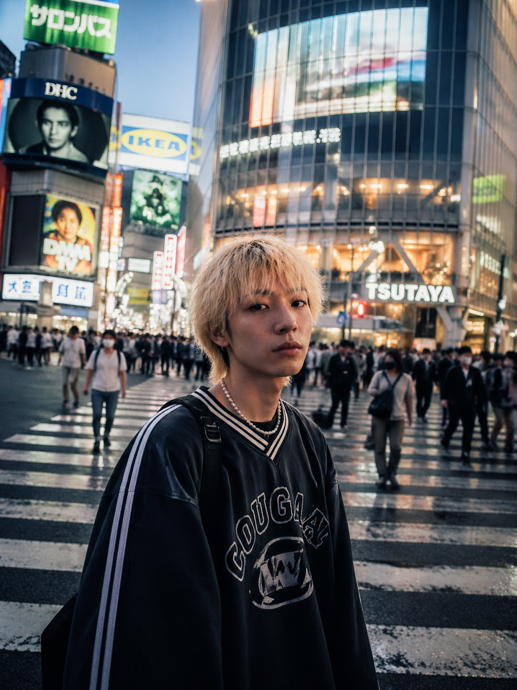
</p>

### 高级时尚 Vogue 封面

> 意大利版 Vogue 封面风格的高级时尚人像。一位轮廓分明的模特，向后梳的铂金发。穿着带几何肩饰的金属银色高级定制。硬工作室灯光创造戏剧性阴影。哈苏拍摄，100mm 镜头。前卫妆容，粗眉，负空间构图。


<p align="center">
  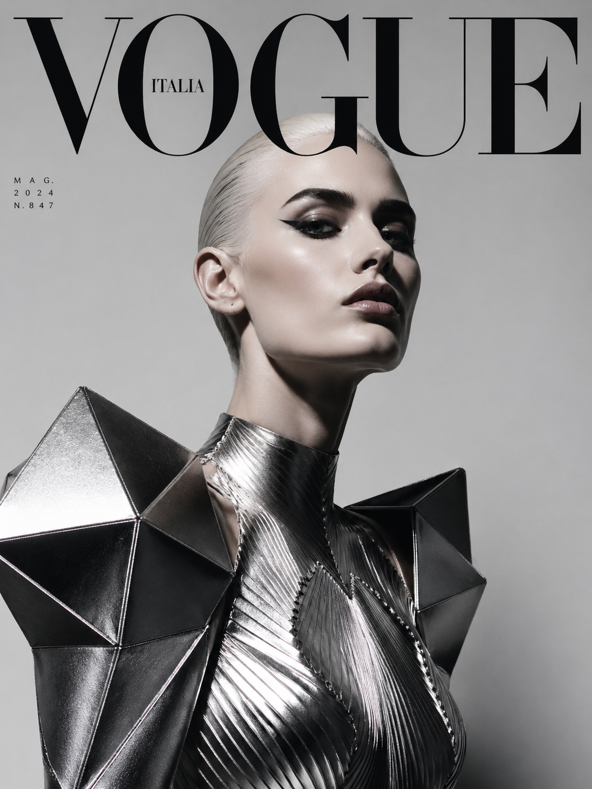
</p>

### 柔和自然光人像

> 柔和自然光人像。一位栗色波浪发女子坐在白色墙壁工作室的大北向窗前。晨光在她脸上创造柔和的伦勃朗窗光。她穿着奶油色亚麻衬衫。淡妆，真实的表情。85mm f/2 拍摄，窗侧轻微过曝。干净、通透、编辑感。


<p align="center">
  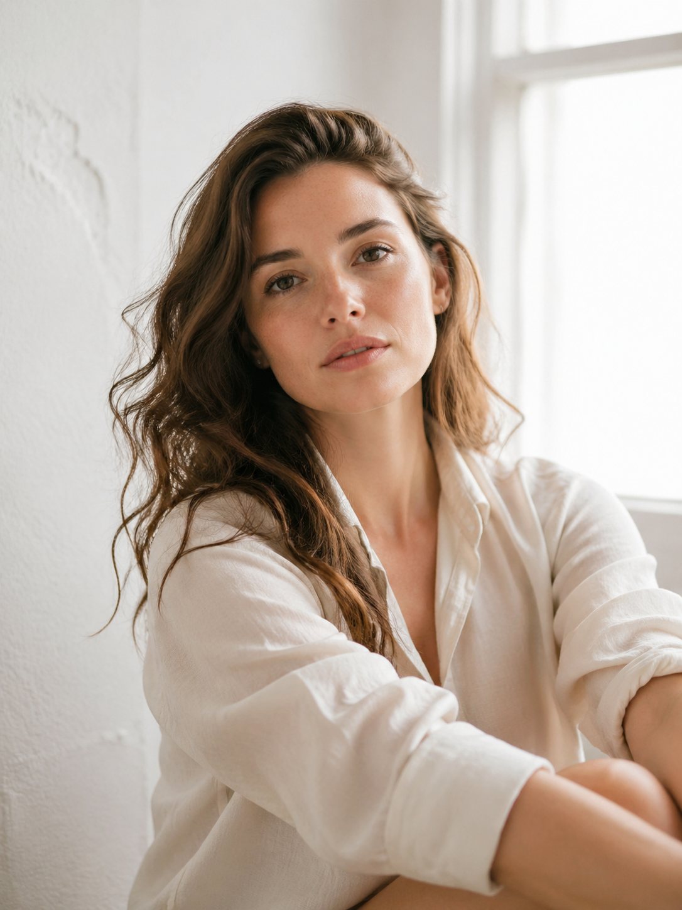
</p>

### 戏剧性黑白人像

> 戏剧性黑白人像。一位留着短灰白胡须、深色眼睛炯炯有神的男子直视镜头。彼得·林德伯格风格，分割灯光 —— 脸的一侧完全照亮，另一侧在深邃阴影中。中画幅胶片拍摄，80mm 镜头。原始、未经修饰的皮肤纹理。强大、阳刚的能量。


<p align="center">
  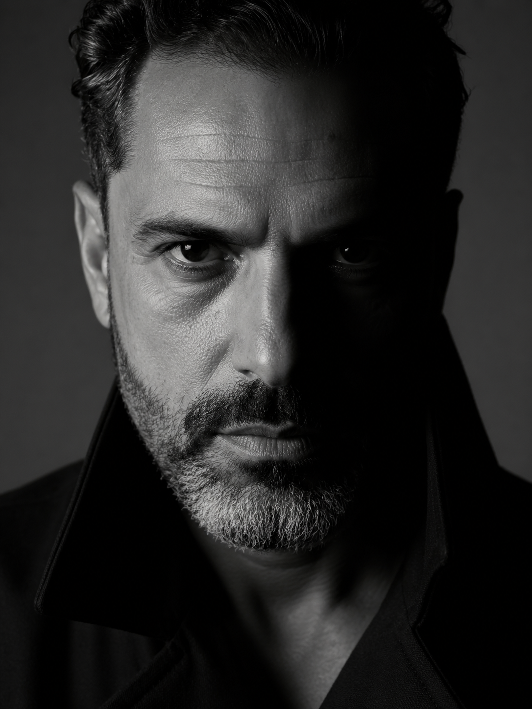
</p>

### 梦幻粉彩美妆

> 梦幻粉彩美妆人像。一位模特，柔和的粉色嘴唇、露珠般肌肤和泛红的脸颊微微向上看。腮红粉色背景，柔光箱照明创造均匀、云朵般的布光。飘逸的发丝捕捉光线。100mm 微距 f/2.8 拍摄。浪漫、空灵、美妆广告美学。


<p align="center">
  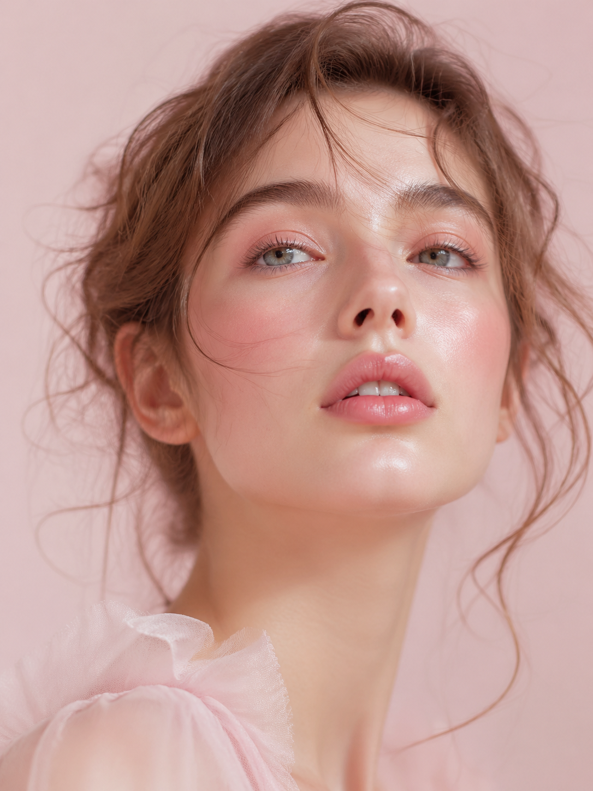
</p>

### 黄金时段人像

> 阳光沐浴的黄金时段人像。一位身穿飘逸奶油色亚麻连衣裙的女子站在麦田日落中。135mm 长焦镜头压缩背景为柔和的金色散景。夕阳产生的镜头光晕。风吹起她的裙子和头发。温暖、怀旧、浪漫氛围。全画幅 f/2 拍摄。


<p align="center">
  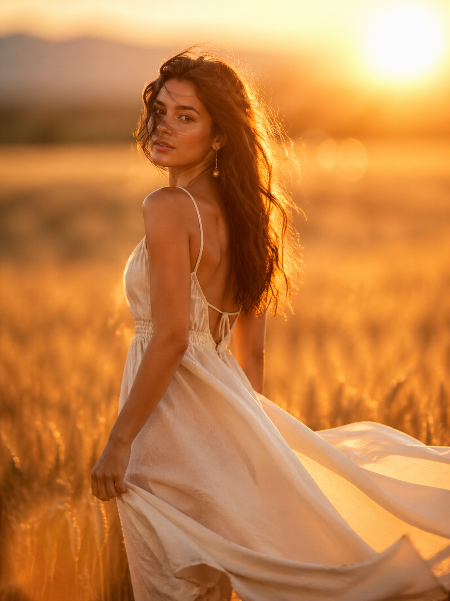
</p>

### 暗黑学院风人像

> 暗黑学院编辑人像。一位红褐色头发松散编成辫子的年轻女子穿着超大号羊毛开衫和白色牛津衬衫。她坐在旧图书馆里绿色银行台灯照亮的桌前。身后书架高耸。钨丝灯光，浅景深。50mm f/1.4 拍摄。知性、舒适、忧郁。


<p align="center">
  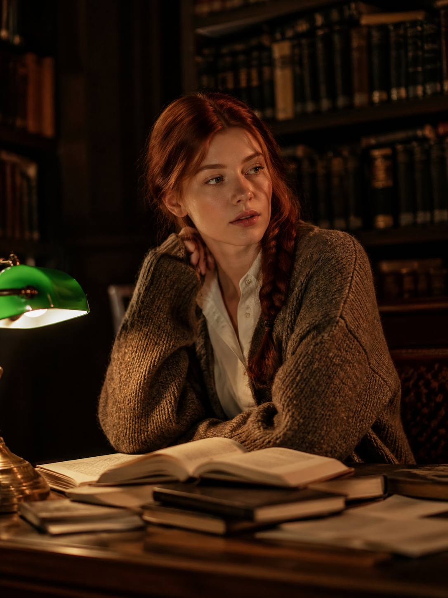
</p>

### 企业头像照

> 专业企业头像照。一位三十后半、穿着炭灰色西装和浅蓝色领带的自信男子。中性灰色背景。经典三点布光设置。85mm f/5.6 拍摄，全图锐利对焦。亲和的微笑，直视镜头。干净、精致、高管级品质。


<p align="center">
  
</p>
---

## 产品摄影

### 极简电水壶

> 一台高级哑光白色电水壶放在浅色橡木支架上。简洁的灰色背景。工作室灯光，清晰的投影。高端生活方式摄影。干净、斯堪的纳维亚美学。f/8、50mm 镜头拍摄。产品目录品质。


<p align="center">
  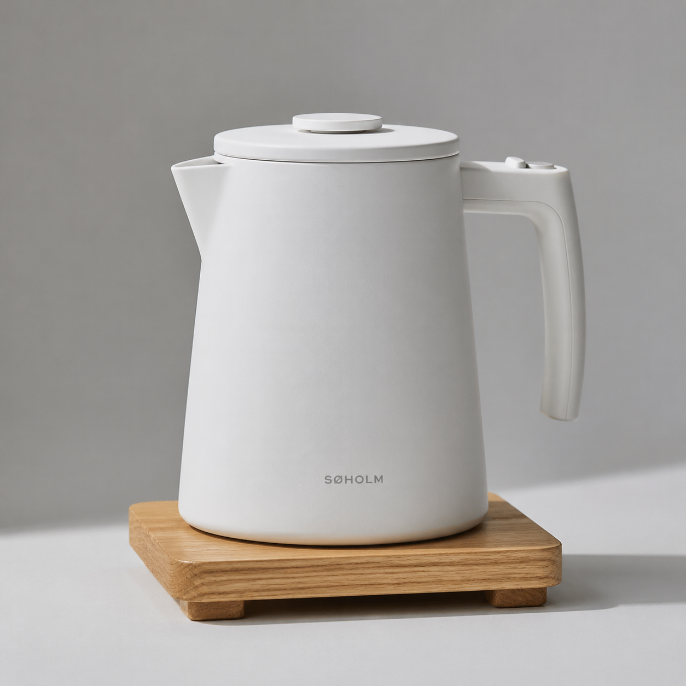
</p>

### 咖啡袋包装

> 一个棕色牛皮纸咖啡袋的特写，直立放置。标签清晰可读，写着 "MIDNIGHT ROAST"，下方用粗体黑色复古字体写着 "Small Batch | Dark Roast | Notes of Chocolate & Cherry"。底部散落着几颗咖啡豆。真实的纸张纹理，哑光表面。左侧柔和自然光。100mm 微距 f/4 拍摄。


<p align="center">
  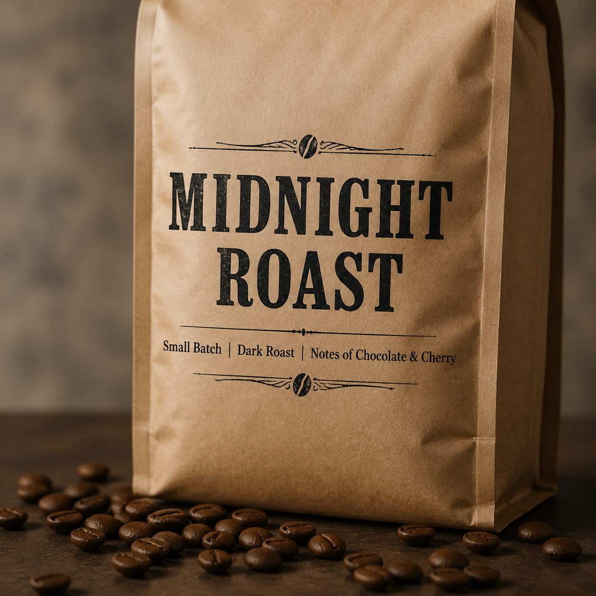
</p>

### 水中香水

> 一个透明玻璃香水瓶，装着淡粉色液体，浸入清澈的水中，周围有小气泡升起。戏剧性的光线通过水和玻璃的折射。深色背景，上方单聚光灯。奢侈品广告风格。微距镜头，f/5.6 拍摄。瓶身无文字。


<p align="center">
  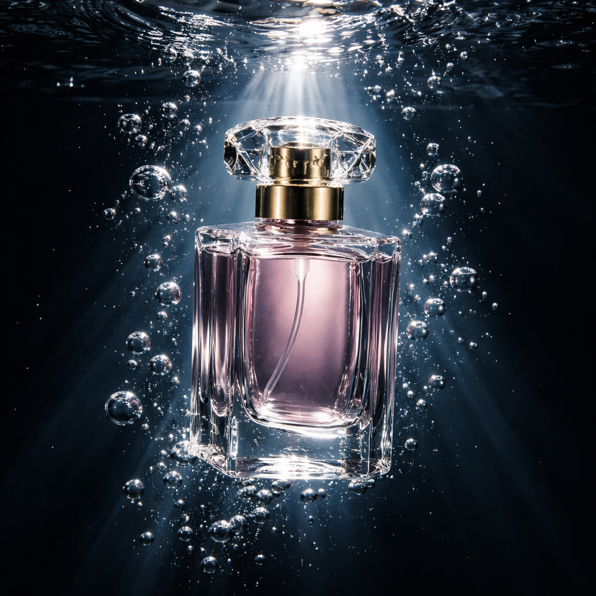
</p>

### 无线耳机微距

> 一副时尚银色无线耳机放在打开的哑光黑色充电盒内。充电盒有一个小型发光绿色 LED 指示灯。深色金属背景。微距摄影，金属网罩和硅胶耳塞的极端细节。100mm 微距 f/2.8 拍摄。科技产品广告美学。


<p align="center">
  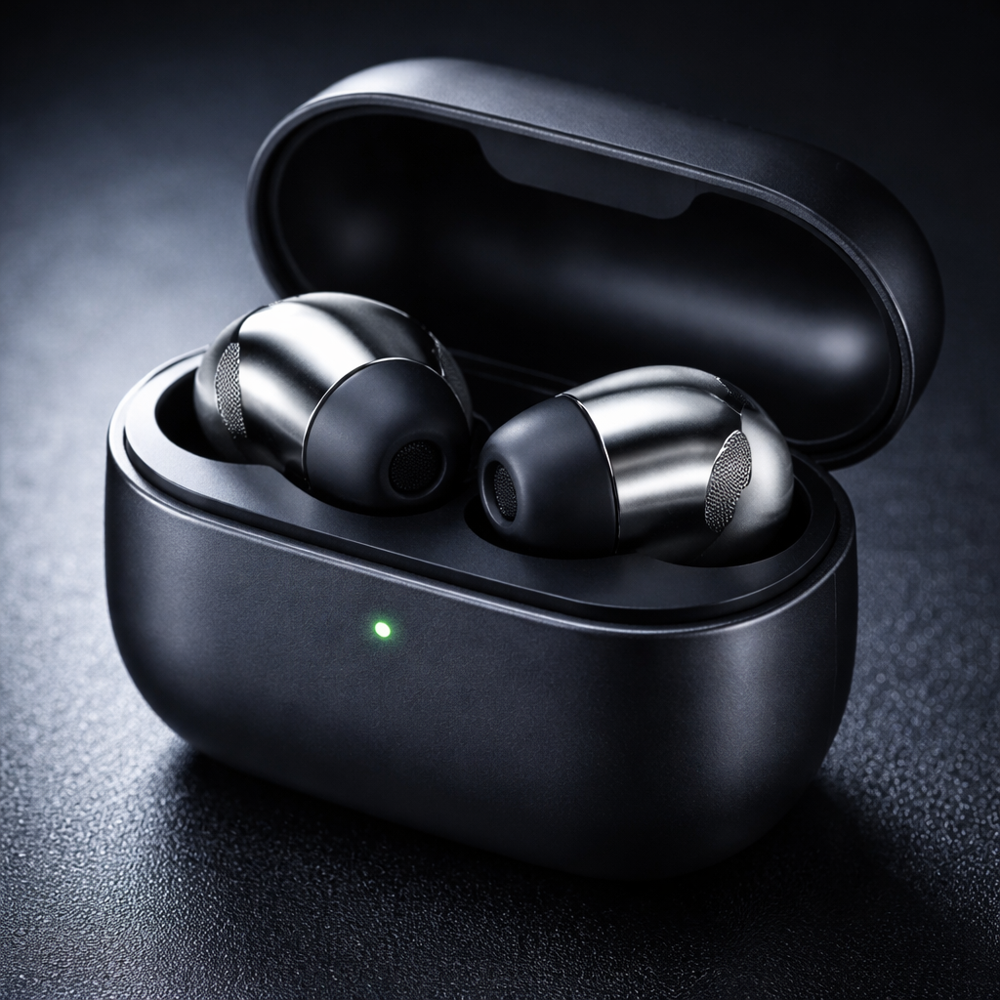
</p>

### 护肤品平铺

> 高端护肤品套装的平铺照片，放在大理石表面上。周围是粉色牡丹花瓣和新鲜绿色桉树叶。左上方的柔和自然窗光。包装上的干净白色文字写着 "7-DAY GLOW"，使用现代衬线字体。极简、奢华美妆美学。50mm f/4 俯拍。


<p align="center">
  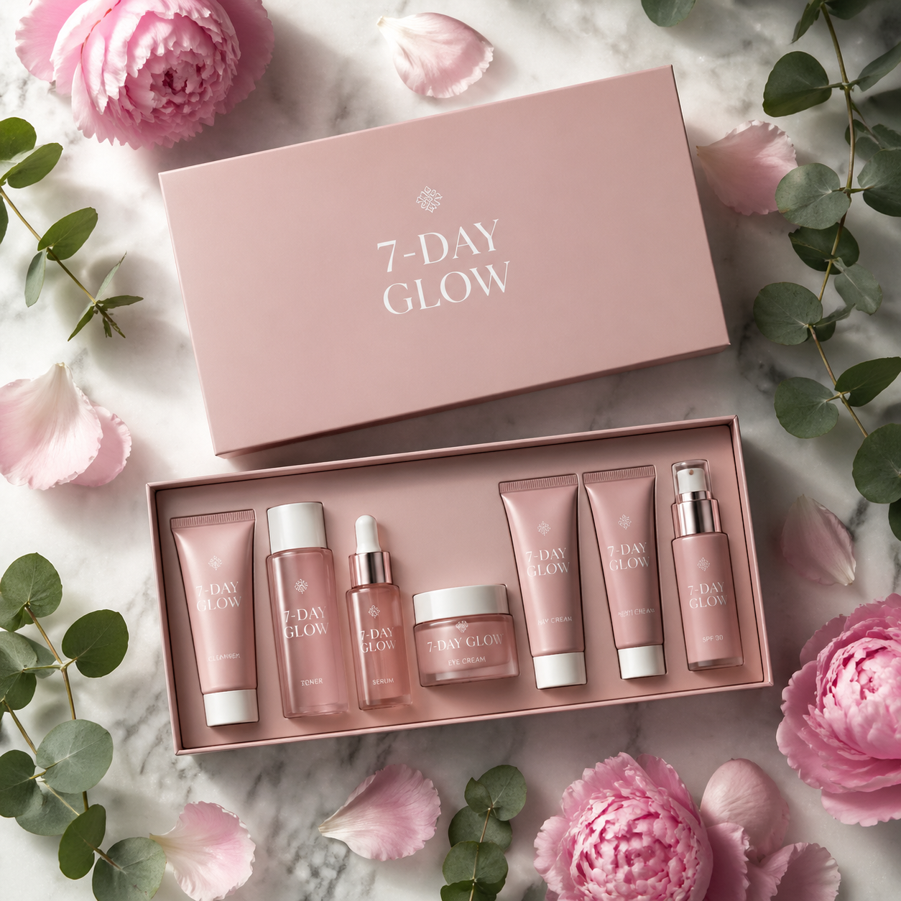
</p>

### 机械键盘

> 一台高级机械键盘，半透明键帽，青紫色 RGB 底光。悬浮式键帽设计，裸露轴体。深色胡桃木桌面，温暖的环境光。产品摄影，35mm f/2.8，WASD 键浅景深。游戏外设美学。


<p align="center">
  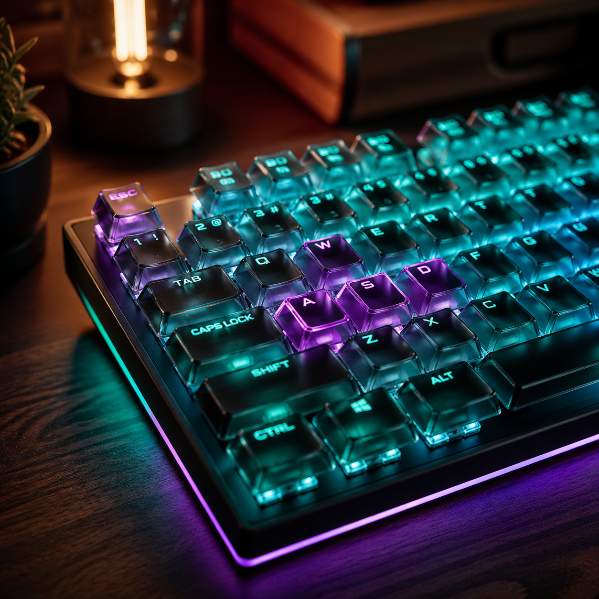
</p>

### 手表产品照

> 一块奢华潜水表，蓝色陶瓷表圈和不锈钢表带，放在深色板岩表面上。戏剧性侧光在蓝宝石水晶上创造锐利反射。表面上有水滴。100mm 微距 f/8 拍摄。每个细节都清晰 —— 日期窗、夜光点、雕刻底盖。产品目录品质。


<p align="center">
  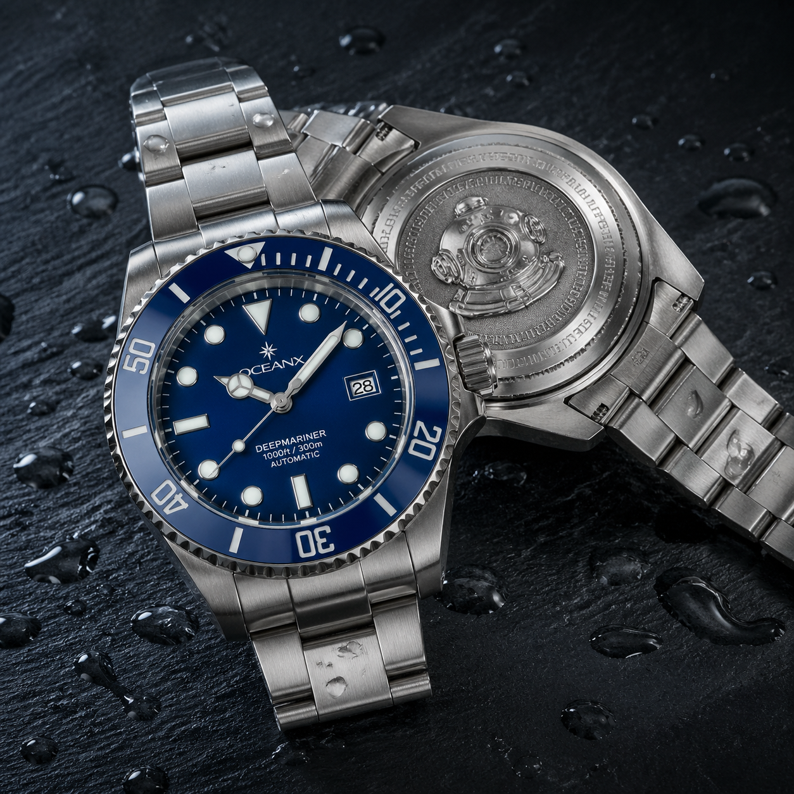
</p>

### 运动鞋英雄照

> 一只崭新的白色皮革运动鞋以 45 度角悬浮在从暖桃色到柔和薰衣草色的渐变背景上。干净的工作室灯光，下方有柔和的倒影。运动鞋有微妙的穿孔和生胶鞋底。f/8、50mm 镜头拍摄。极简、值得发 Instagram 的产品摄影。


<p align="center">
  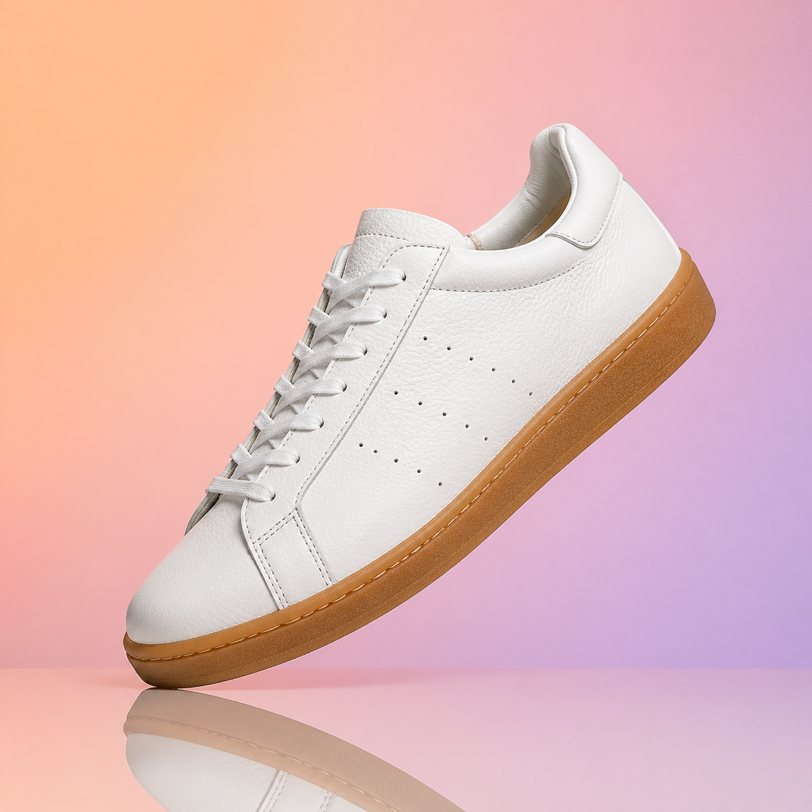
</p>
---

## UI 与应用设计

### 金融科技加密钱包

> 一款名为 "Vault" 的加密货币钱包应用的高保真移动端 UI。显示总余额卡片 "$12,450.00" 和绿色 "Up 5.2%" 趋势线。下方：带币种图标的最近交易列表。深色模式界面，霓虹绿色按钮和图表点缀。极简玻璃拟态卡片。iPhone 15 Pro 框架。所有文字清晰可读。


<p align="center">
  
</p>

### 旅行社落地页

> 一家名为 "Wanderlust" 的豪华旅行社的网站首屏设计。背景：马尔代夫水上别墅夕阳的震撼航拍。大号白色标题："ADVENTURE AWAITS"，使用优雅衬线字体。副标题："为现代探索者策划的旅程。" 中间清晰的珊瑚色 "Book Now" 按钮。干净、令人向往、高端网页设计。


<p align="center">
  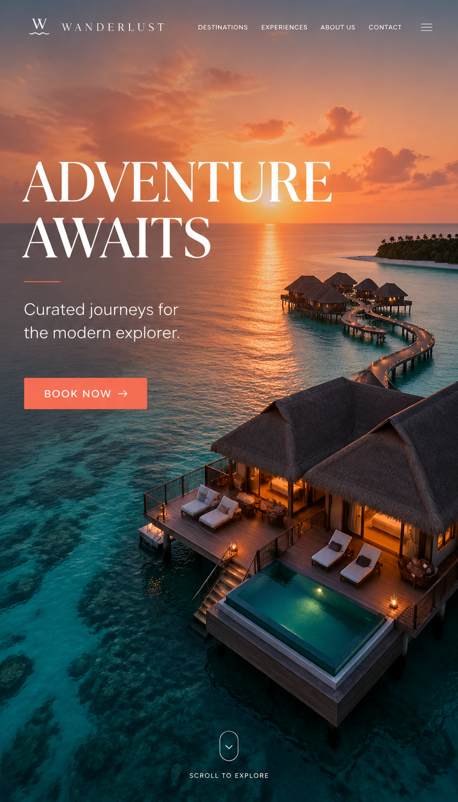
</p>

### 智能家居仪表盘

> 平板屏幕显示智能家居仪表盘。控制项包括 "客厅灯光"（滑块在 70%）、"空调"（设定 22 度 C）和 "安防系统"（已布防）。柔和 UI 设计中干净、易识别的图标。浅色模式、圆角、微妙阴影。干净桌面上的真实设备模型。所有 UI 元素清晰可读。


<p align="center">
  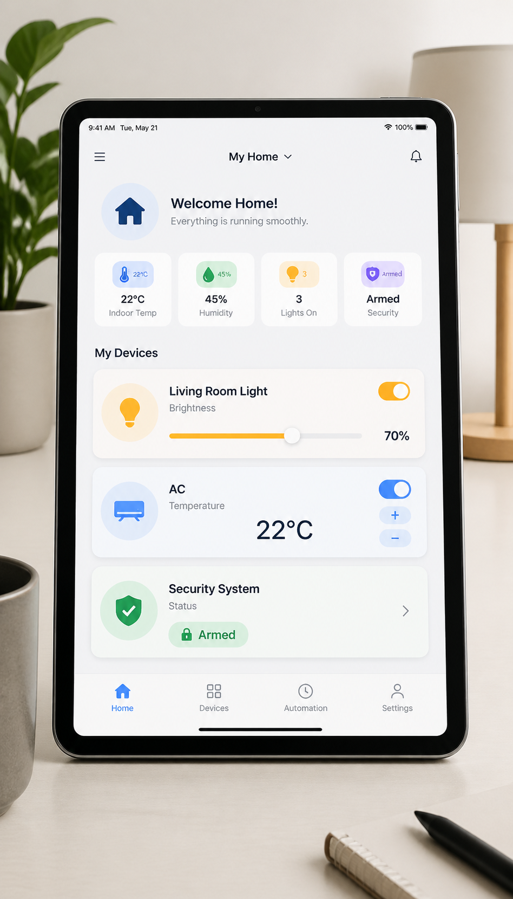
</p>

### 电商应用 UI

> 时尚电商应用的高保真移动端应用截图。主屏幕包含：展示 "SPRING COLLECTION" 促销的 Hero 横幅、分类网格（女装、男装、配饰、促销）和 "Trending Now" 产品卡片横向滚动。干净白色背景，黑色排版，鼠尾草绿最小点缀色。iPhone 框架，所有文字可读。


<p align="center">
  
</p>

### 健身应用训练界面

> 显示活跃训练的移动健身应用界面："HIIT 爆发力 — 第 3 轮共 5 轮。" 大号粗体计时器显示 "00:45"。下方：波比跳动作图示、次数计数器和心率 165 BPM。深色模式配电蓝色点缀。激励、活力的 UI 设计。干净排版，清晰层级。


<p align="center">
  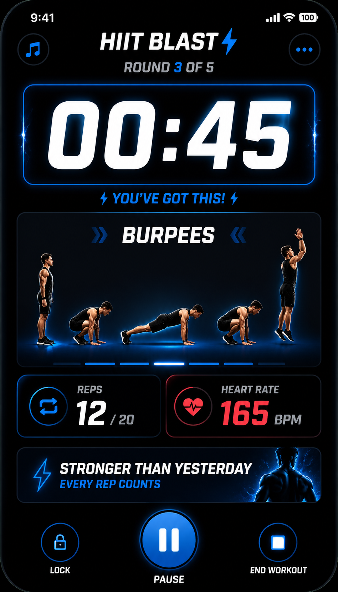
</p>

### 餐厅菜单应用

> 一家名为 "Trattoria" 的意大利餐厅的美丽移动端菜单应用。优雅的衬线排版，奶油色背景配酒红色点缀。新鲜意面的 Hero 图片。分类：前菜、头盘、主菜、甜点。每道菜有价格、描述和饮食图标。温暖、诱人、精致的设计。所有文字清晰可读。


<p align="center">
  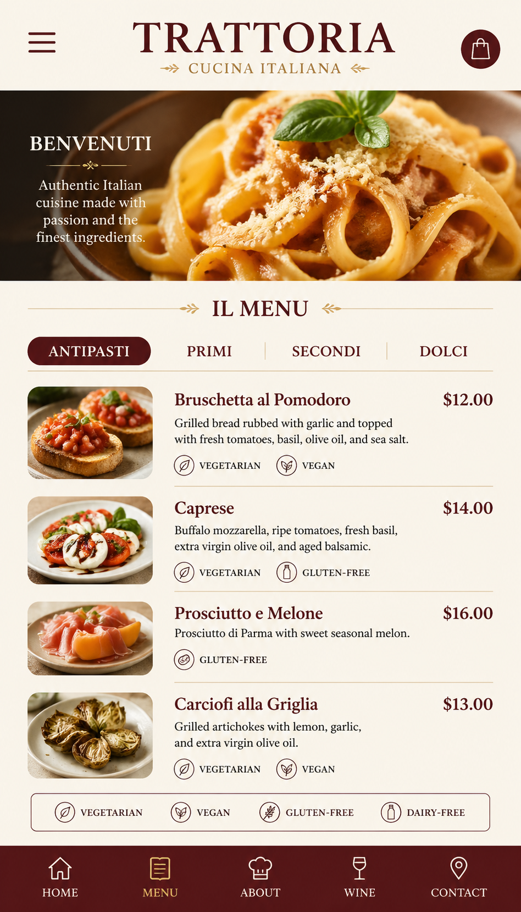
</p>

### 播客播放器界面

> 深色背景上的播客播放器应用界面。正在播放："The Future of AI" 第 47 集。中央大号圆形专辑封面。显眼的播放/暂停按钮。进度条显示 23:14 / 58:32。下方：播放速度 (1.2x)、睡眠定时器和队列列表。极简、深色模式、紫色点缀。干净、现代音频 UI。


<p align="center">
  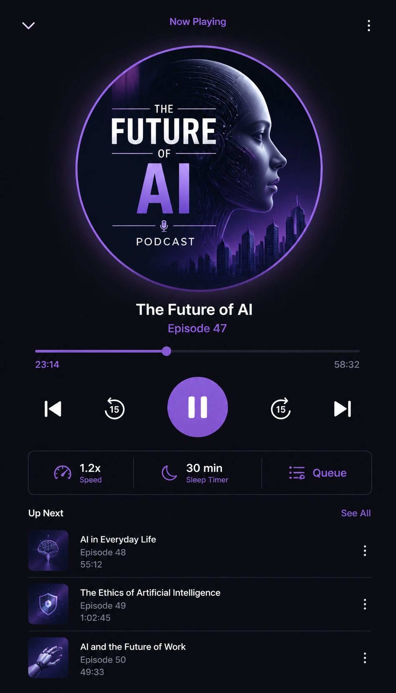
</p>

### 天气小组件设计

> 一个精美的天气小组件，显示 "San Francisco, 72 degrees F, Partly Cloudy"。大号太阳躲云图标插图。下方每小时预报行，带小图标和温度。7 天预报列表，含最高/最低温。从浅蓝到白色的柔和渐变背景。圆角卡片设计，干净的无衬线排版。iOS 小组件美学。


<p align="center">
  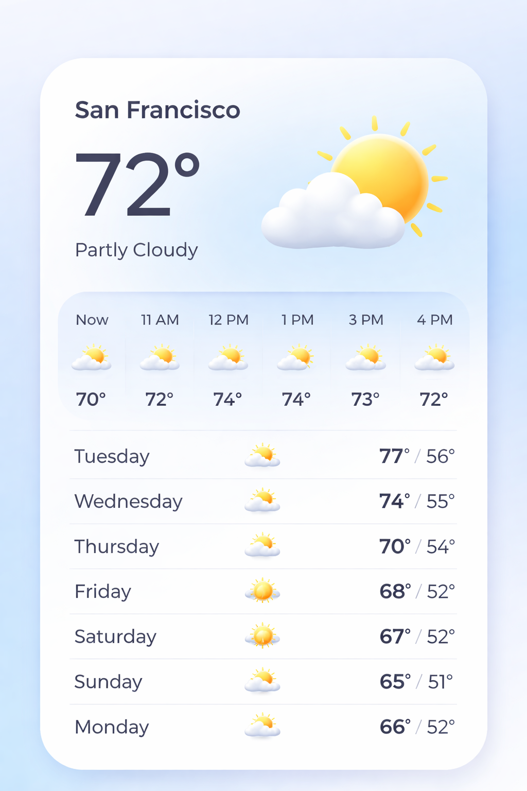
</p>
---

## 奇幻与动漫

### Ufotable 战士公主

> 史诗级动漫风格奇幻战士公主，飘逸的银白色长发及腰。她穿着镶嵌蓝宝石的华丽银色盔甲。右手持发光的天界之剑，剑身周围有光粒特效。Ufotable 动画工作室制作质量。动态姿势，风吹动的衣装。4K，电影级灯光，粒子特效。


<p align="center">
  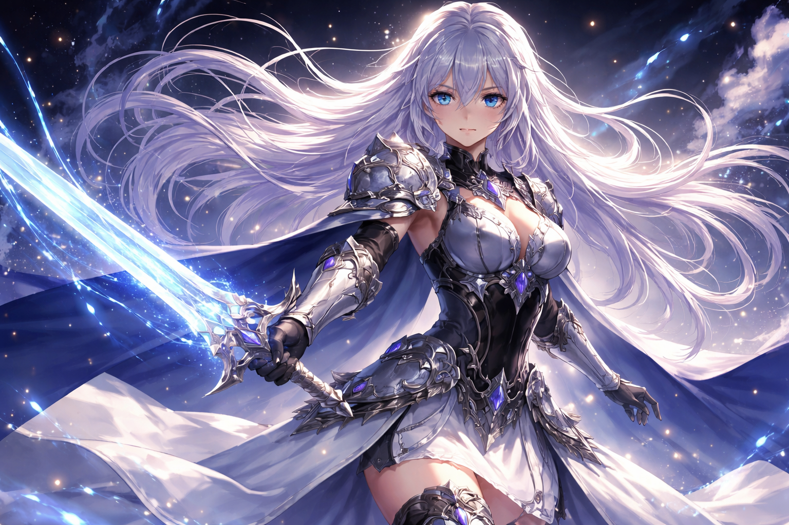
</p>

### 吉卜力森林精灵

> 吉卜力工作室风格的画意场景。一只看起来像发光白色狐狸、有三条蓬松尾巴的小森林精灵坐在古老森林中长满苔藓的石头上。萤火虫在它周围飞舞。柔和水彩背景，树叶间斑驳的阳光。宫崎骏美学，手绘质感，温暖怀旧。


<p align="center">
  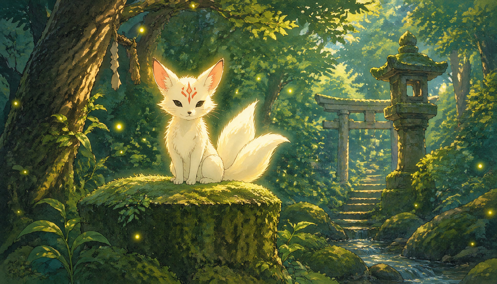
</p>

### 奥术风格角色

> 网飞《奥术》动画系列风格插画。一位蓝尖辫发、蒸汽朋克护目镜推到额头上的年轻女子。她穿着带黄铜扣件的皮革飞行员夹克。紫色和青色色调，Fortiche 工作室美学。画意数字艺术，戏剧性边缘光，电影级构图。


<p align="center">
  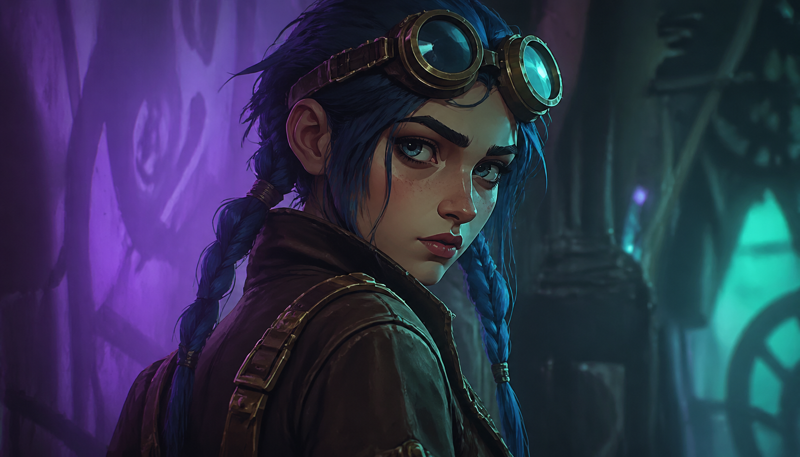
</p>

### 万智牌巨龙

> 万智牌卡牌风格的奇幻插画。一只巨大的红龙，黑曜石鳞片从熔岩中现身，双翼展开。前景中一个持盾的渺小骑士作为比例参考。Greg Rutkowski 风格影响，戏剧性透视，丰富饱和的色彩。奇幻卡牌艺术品质。


<!-- Image not found -->
### 赛博朋克武士

> 赛博朋克奇幻融合。一位女性武士手持铬合金武士刀站在新东京雨中的屋顶。传统和服由全息面料制成。全息樱花在她周围飘落。霓虹招牌反射在她的面罩中。大友克洋/攻壳机动队风格。雨、霓虹、传统与未来的碰撞。


<p align="center">
  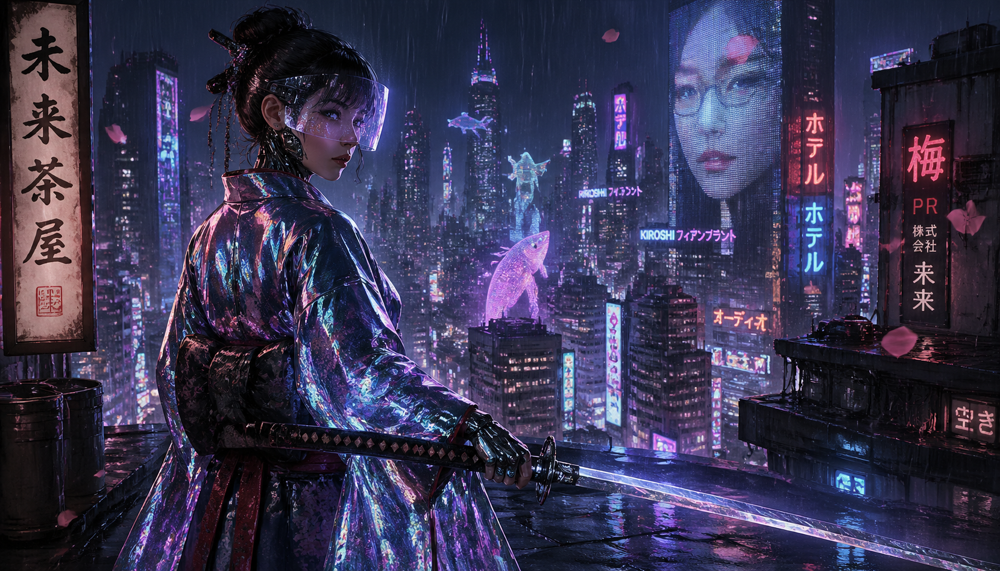
</p>

### 皮克斯风格角色

> 一个 3D 皮克斯风格角色，一个友好的机器人手持小花，3/4 正面视角。上方柔和的电影级主光，背后温暖的轮廓光。大而富有表现力的眼睛，柔软圆润的脸颊，温柔的微笑。光滑的次表面散射，带散丝的蓬松头发。背景：干净的粉彩渐变。电影级渲染质量。


<p align="center">
  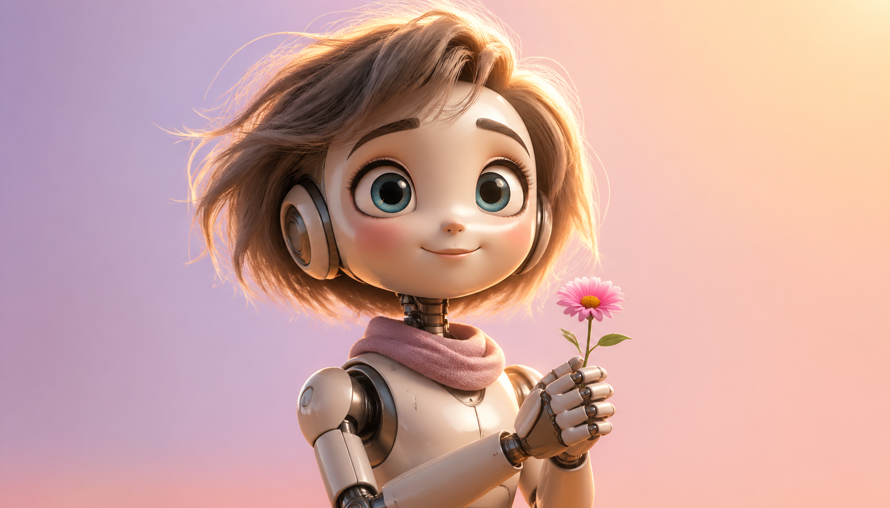
</p>

### 暗黑奇幻女巫

> 暗黑奇幻暗黑精灵女巫，飘逸的午夜紫色长发，尖耳朵和发光的紫色眼睛。她穿着印有真实星星的星座图案斗篷。奥术能量在她双手周围旋转。星空背景。下方戏剧性灯光，创造恐怖的底光。数字绘画，高细节。


<p align="center">
  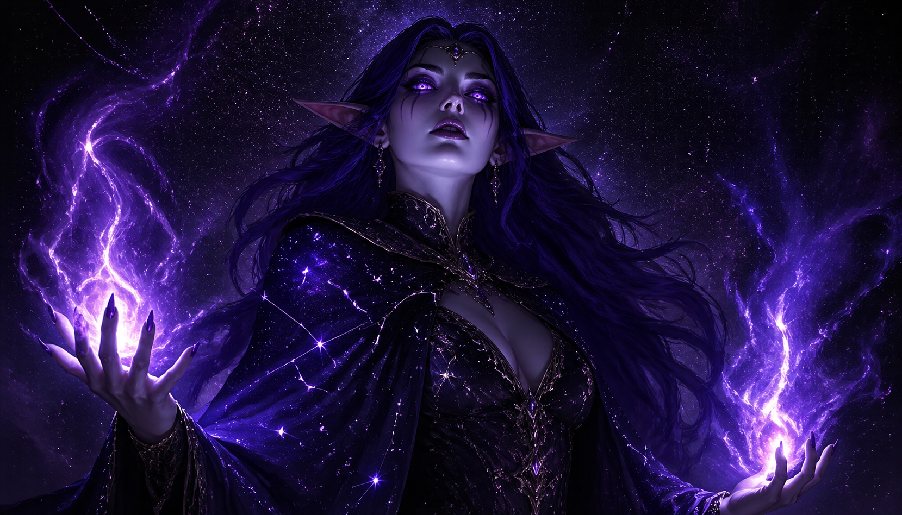
</p>

### 空灵美人鱼

> 空灵水下奇幻。一位优雅的美人鱼，彩虹般的蓝紫色鳞片在珊瑚礁中游泳。长发随水流飘动。附近有生物发光的水母。上方水面穿透的阳光射线。Lisa Frank 遇上国家地理。梦幻、鲜艳、魔幻。


<p align="center">
  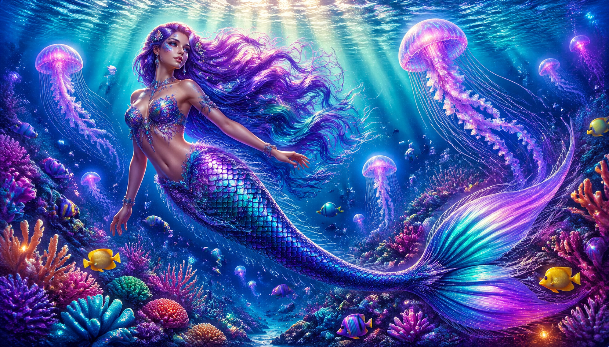
</p>

### 蒸汽朋克飞艇船长

> 插画蒸汽朋克奇幻肖像。一位年轻的女飞艇船长，穿着带金色肩章的黄铜纽扣红色军装。护目镜搁在皮革飞行员帽上。一只黄铜机械鸟栖息在她肩上。风之谷/哈尔的移动城堡风格启发。温暖、冒险、详细插画。


<p align="center">
  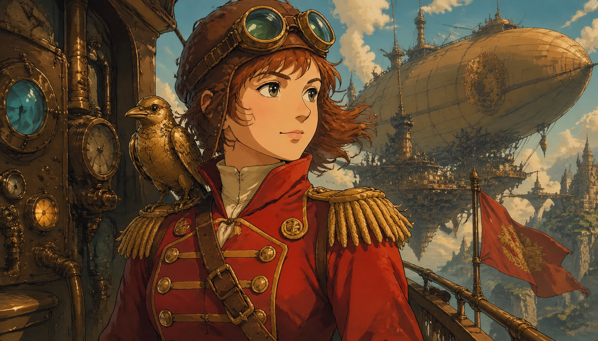
</p>

### Q版角色 lineup

> 5 个可爱 Q 版角色的 lineup，代表不同季节：春（粉色樱花）、夏（太阳帽和西瓜）、秋（橙色树叶和围巾）、冬（蓝色外套和雪花），还有一个季节小精灵。可爱风格，大头小身体，粉彩色调。干净白色背景。角色设计表布局。


<p align="center">
  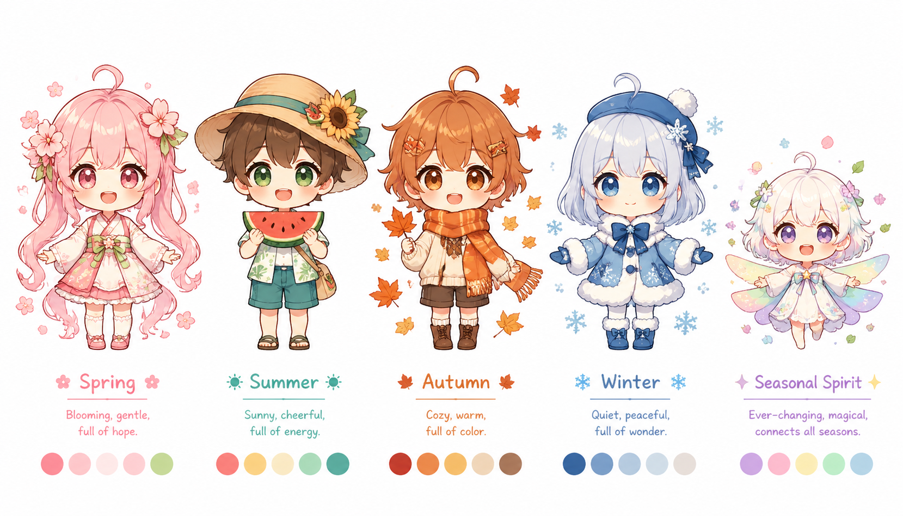
</p>
---

## 自然与风景

### 冰岛黑沙滩

> 戏剧性的冰岛 Reynisfjara 黑沙滩黎明广角风景。巨大的玄武岩石柱从汹涌的北大西洋中升起。低雾飘过黑色火山沙。一个穿着亮红色雨衣的孤独身影沿着海岸线行走作为比例参考。沉郁的去饱和色调 —— 几乎是单色，只有红色雨衣作为点缀。24mm 广角镜头，f/11 深景深。超精细 4K。


<p align="center">
  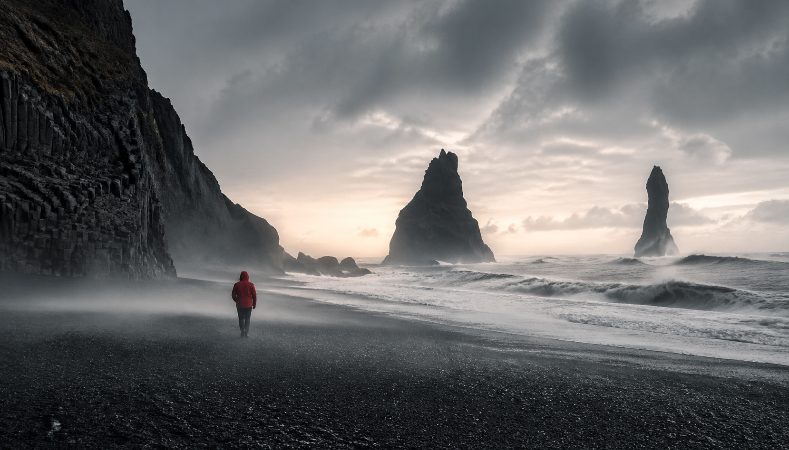
</p>

### 北极光小屋

> 挪威峡湾山谷中一座温暖灯光的小木屋的广角风景，凌晨 1 点。壮观的绿色和紫色北极光在头顶舞动，倒映在静止的黑色峡湾水面中。雪景松树和山脉框住场景。小屋的光芒是寒冷构图中唯一的暖色。20 秒长曝光质感。超真实 4K 天文摄影。


<p align="center">
  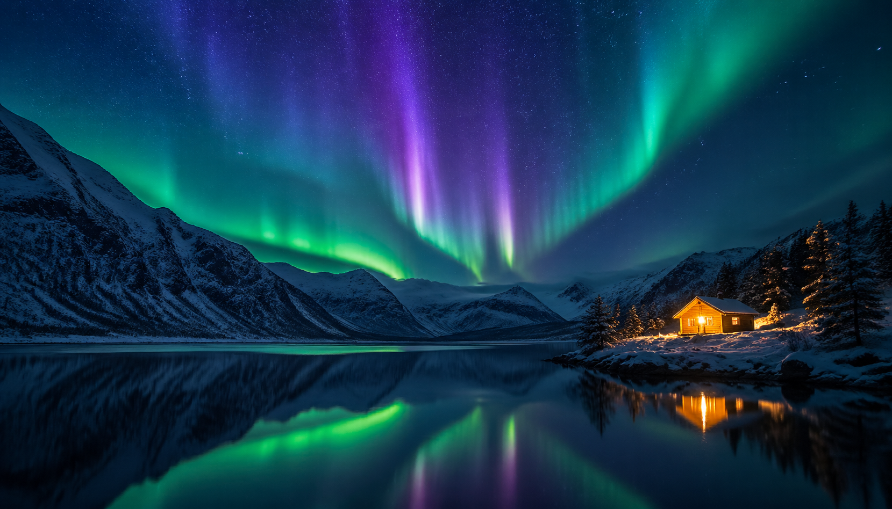
</p>

### 加州红杉林

> 仰视加州红杉林的垂直构图。阳光穿透树冠形成戏剧性上帝之光。画面底部一个小小的人影作为比例参考。14mm 超广角镜头，极端透视畸变。丰富的绿色调，雾气氛围。教堂般的敬畏感。


<p align="center">
  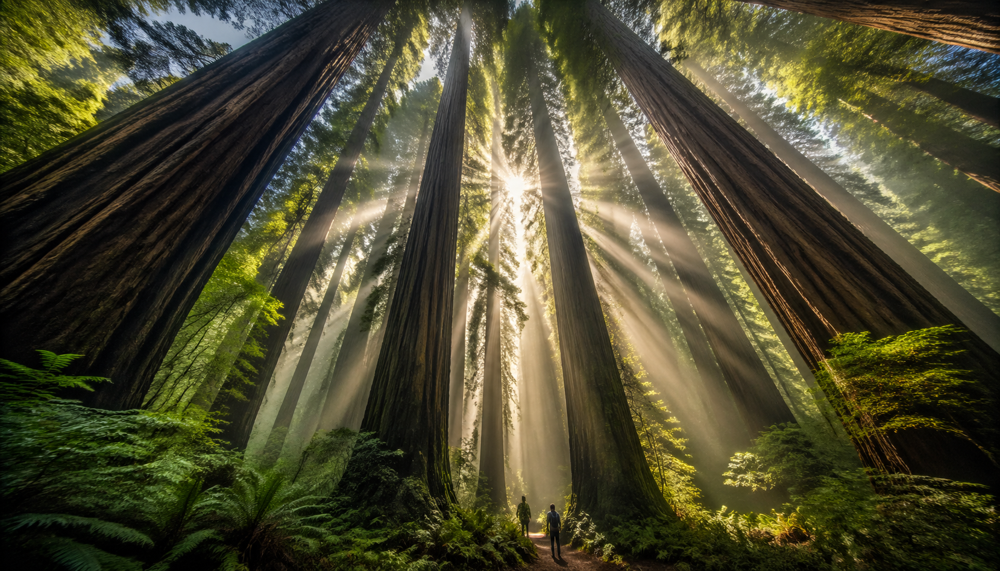
</p>

### 巴塔哥尼亚镜面湖

> 完美镜面反射的巴塔哥尼亚 Torres del Paine 尖峰在玻璃般平静的阿尔卑斯湖中，蓝色时刻。岸边一顶 tiny 橙色帐篷作为比例参考。对称构图，超平静水面。山峰上的粉橙朝霞。中画幅拍摄，35mm 镜头。超精细、宁静。


<p align="center">
  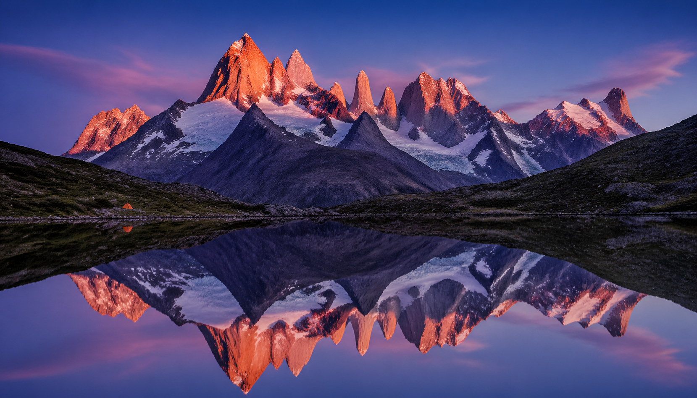
</p>

### 撒哈拉沙漠风暴

> 沙尘暴开始时的广阔撒哈拉沙漠。起伏的橙色沙丘延伸到地平线下阴沉的天空下。沙丘脊线上一个孤独的骆驼和骑手剪影。单色橙色调色板，深邃阴影对比。70-200mm 135mm 端拍摄。戏剧性、史诗、末日氛围。


<p align="center">
  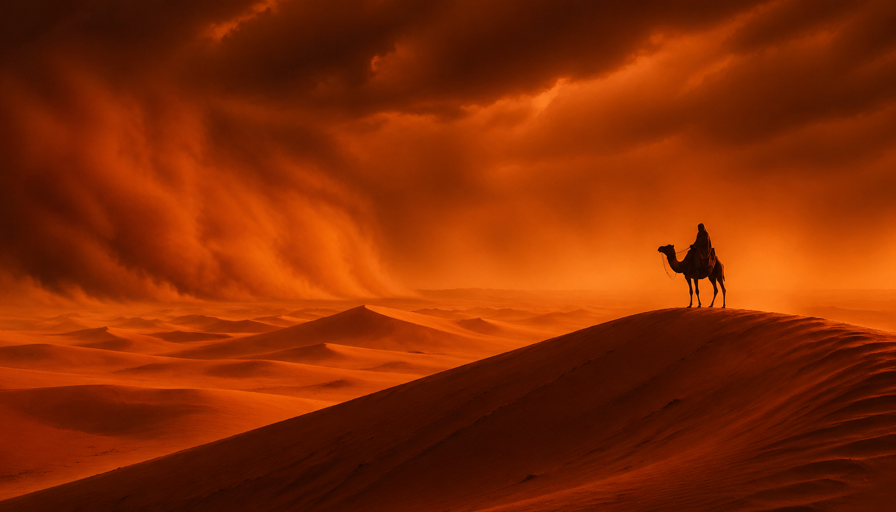
</p>

### 京都樱花

> 京都哲学之道樱花盛开高峰期的宁静广角风景。一条石头运河两旁是盛开的粉色樱花树。花瓣飘在水面和铺满道路。晨雾，柔和的漫射光。远处一位穿传统和服的人行走。梦幻、浪漫、日式美学。


<p align="center">
  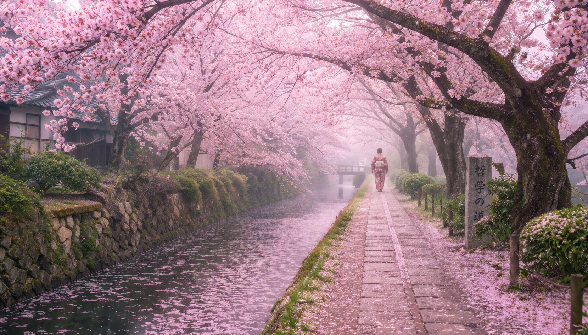
</p>

### 苏格兰高地风暴

> 暴风雨正在消散的苏格兰高地戏剧性风景。风沼上的古老立石。山谷后方一道双彩虹。乌云分开露出金色光线。24mm 广角镜头拍摄。忧郁、神秘、凯尔特氛围。


<p align="center">
  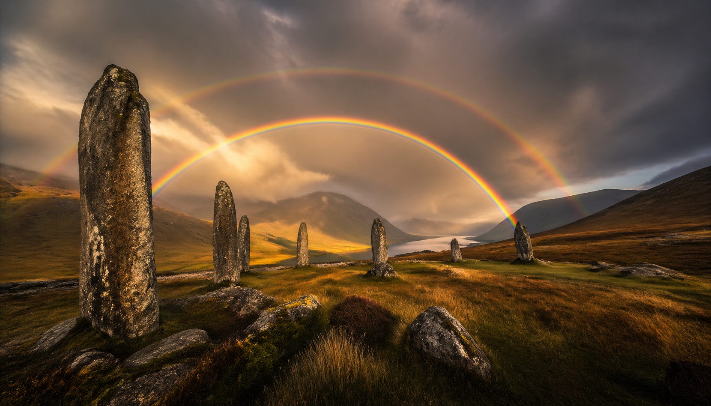
</p>

### 肯尼亚大象家族

> 日落时肯尼亚金色稀树草原上大象家族穿越的电影级广角镜头。它们脚下扬起的尘埃捕捉到温暖的逆光。地平线上猴面包树的剪影。国家地理风格，200mm 长焦镜头压缩层次。温暖的橙色和琥珀色调。野生动物摄影杰作。


<p align="center">
  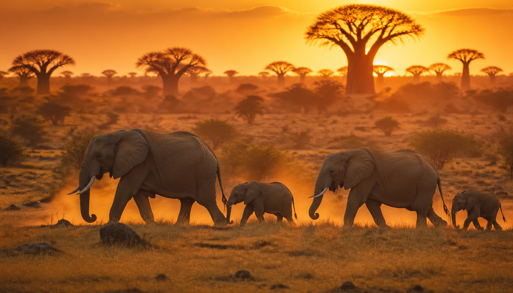
</p>

### 马尔代夫航拍

> 一位穿着极简白色比基尼的美丽女子在清澈 turquoise 浅水中仰面漂浮的俯拍无人机镜头。她的头发在头部周围散开成光环。透过透明水面可见的白色沙底。航拍视角，偏振滤镜。热带天堂美学。


<p align="center">
  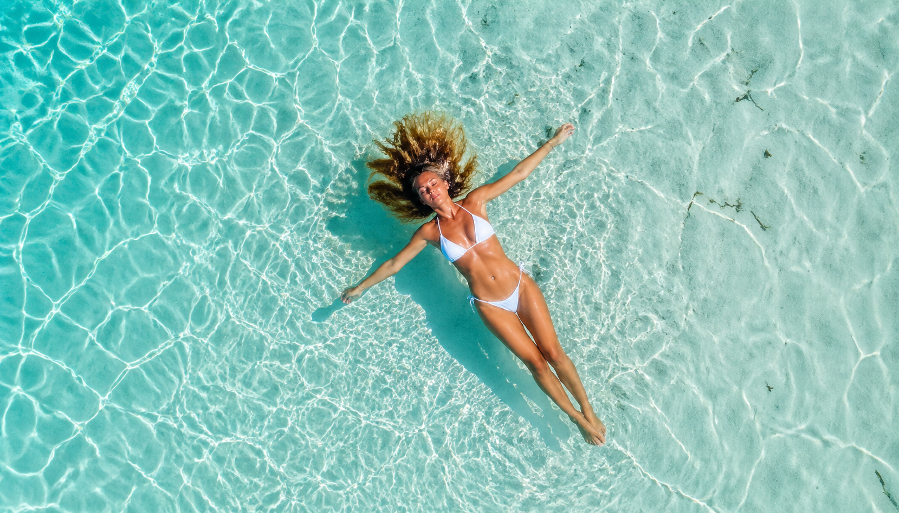
</p>

### 瀑布悬崖奇幻

> 空灵奇幻自然场景。一位身穿飘逸薄纱连衣裙的优雅年轻女子站在高耸的瀑布悬崖边缘。热带雾气环绕她。俯视角度，广阔比例。下方郁郁葱葱的绿色丛林。梦幻、浪漫、冒险旅行美学。无人机拍摄，广角。


<p align="center">
  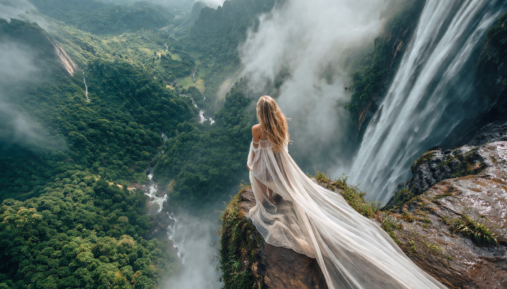
</p>
---

## 营销与社媒

### 病毒式发布卡片

> 一部虚构的 Instagram 个人主页页面的超真实 iPhone 截图，为列奥纳多·达·芬奇而设，用户名 @davinci_official，仿佛他是 2026 年的现代网红。头像是一幅文艺复兴时期的自画像，圆形裁切。简介写着："Artist, Engineer, Inventor | Currently dissecting things | DM for commissions"。网格显示 9 篇帖子：《蒙娜丽莎》重新框定为镜子自拍、标题为 "just dropped my new drone design" 的直升机草图、作为健身房进步照片发布的人体解剖学研究。完整的 iOS 状态栏。深色模式 UI。照片级真实截图品质，16:9。


<p align="center">
  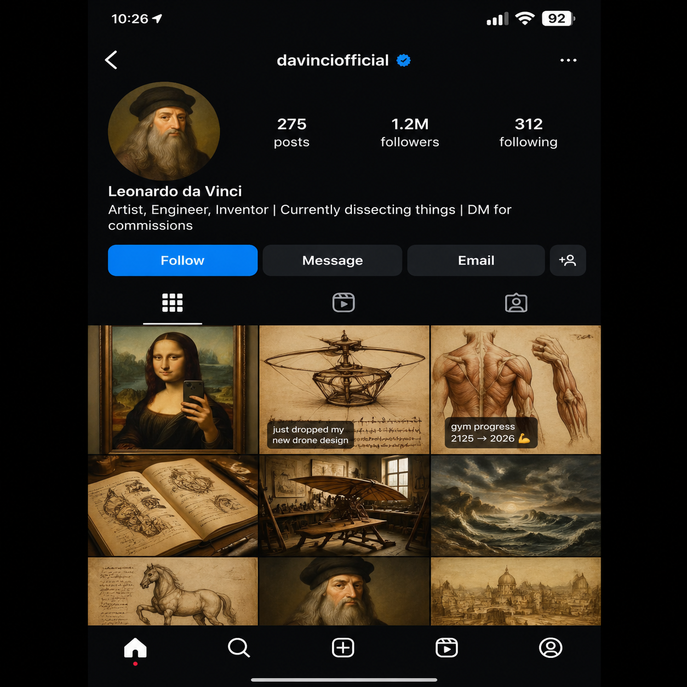
</p>

### 3D 公告海报

> 数字工作空间的 3D 等距插画。中央一台发光笔记本电脑，屏幕中弹出一个 3D 语音气泡，用粗体干净的 3D 字母写着 "AI IS HERE"。鲜艳的紫色和蓝色调色板。柔和粘土风格渲染，高品质 3D 艺术。16:9 宽高比，完美适配社交媒体。


<p align="center">
  
</p>

### YouTube 缩略图

> 分屏图像。左侧：一位沮丧的男子看着一堆凌乱的文件。右侧：同一个男子微笑着拿着一台干净的平板电脑。高对比度色彩，富有表现力的面部特征。中央亮黄色文字叠加："THE FIX"。照片级真实，16:9，为最大点击率设计。


<p align="center">
  
</p>

### Instagram 故事广告

> 奢侈护肤品牌的垂直 9:16 Instagram 故事广告。一位皮肤发光的美丽模特涂抹精华液。文字叠加："Your Glow-Up Starts Here"，使用优雅手写体。底部 "Swipe Up to Shop" 按钮。柔和的粉色和金色调色板。高级美妆广告美学。


<p align="center">
  
</p>

### 播客封面艺术

> 大胆的播客封面设计。深色海军蓝背景，中央一个大型 3D 麦克风，包裹着彩色声波。标题："THE CREATIVE HOUR" 使用粗体白色无衬线字体。副标题："与创造者和思想家的对话。" 现代、吸睛、在播客目录中脱颖而出的设计。方形 1:1 格式。


<p align="center">
  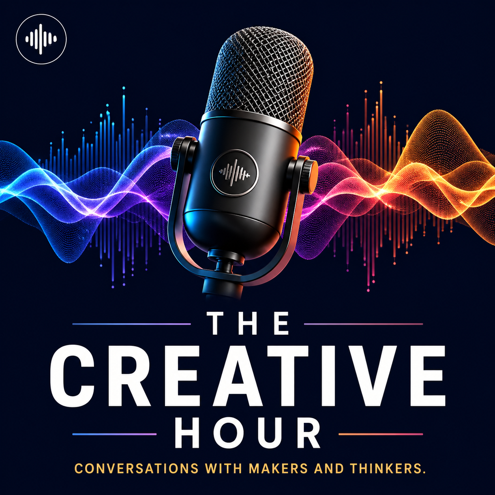
</p>

### 活动海报

> 设计会议的大胆当代排版海报，纵向 2:3 比例。背景：深午夜蓝渐变，带微妙纸张颗粒。主标题用超大号几何无衬线字体写着 "DESIGN FUTURES 2026"。副标题："Amsterdam | March 15-17。" 装饰元素：一个珊瑚色的极简抽象圆形。编辑杂志美学。


<p align="center">
  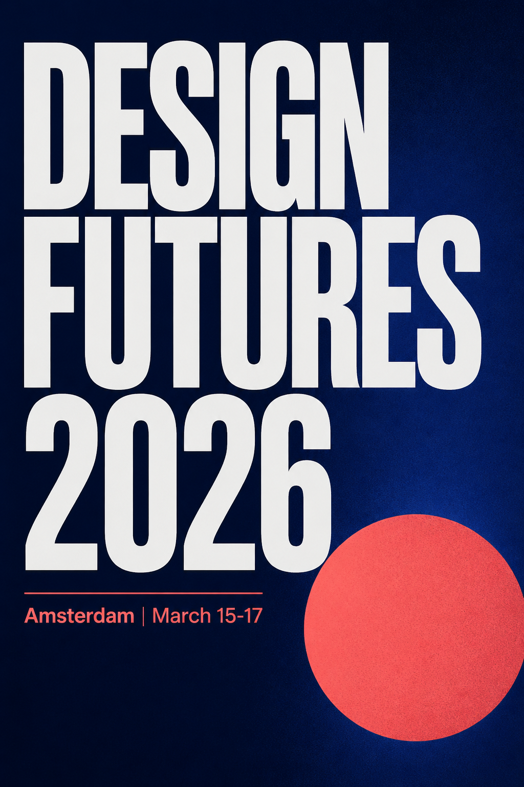
</p>

### 领英轮播幻灯片 1

> 关于 "5 AI Tools Every Designer Needs" 的领英轮播帖子的干净信息图幻灯片。大号珊瑚色圆形中的数字 "1"。粗体标题："GPT Image 2"。下方简要描述。魔杖生成图像的图标。干净白色背景，专业企业设计。1:1 方形格式。


<p align="center">
  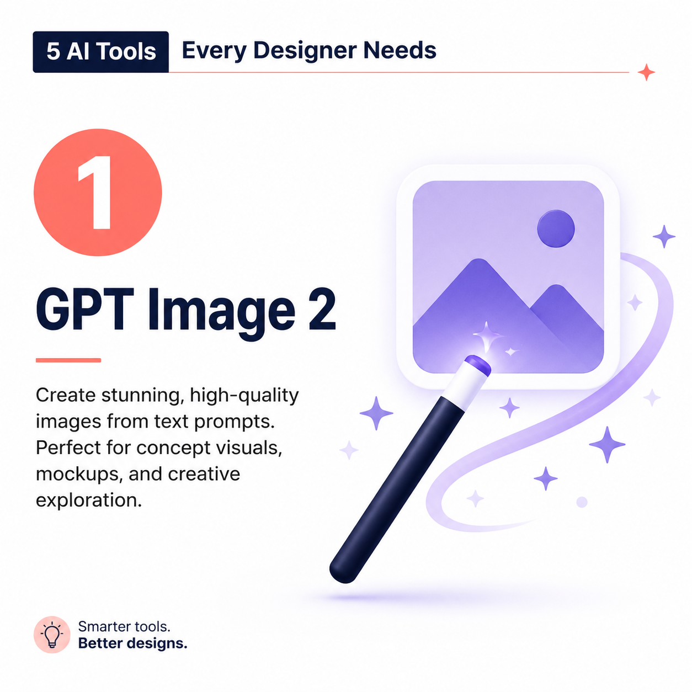
</p>

### 电商直播 UI

> 类似抖音商店或 Instagram 直播购物的电商直播界面模型。中央一位穿红色连衣裙的模特。产品卡片叠加显示 "Vintage Red Dress — $89.99" 和 "Add to Cart" 按钮。实时观看人数：12.4K。右侧评论流。底部互动按钮。现代、 trendy、转化优化。


<p align="center">
  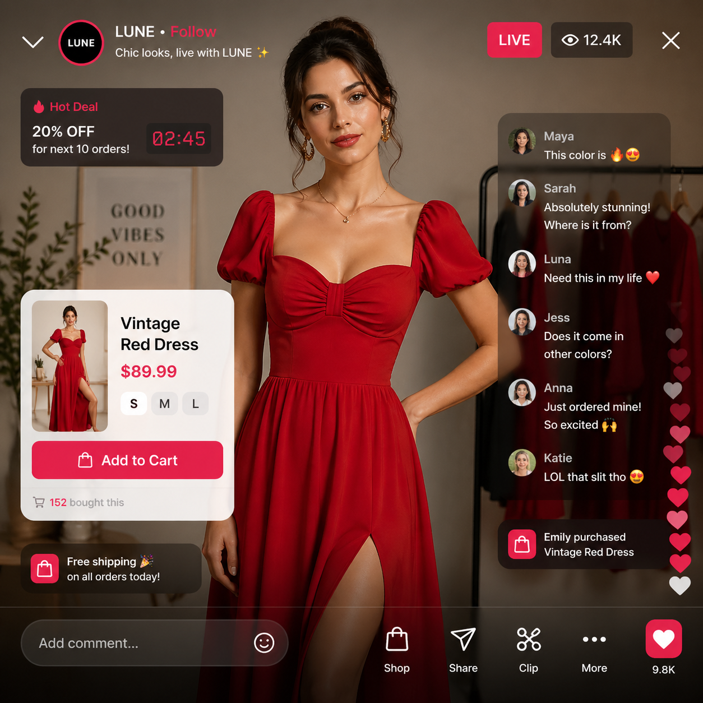
</p>
---

## 排版与海报

### 复古招牌

> 砖墙上风化的复古手绘招牌。文字 "OPEN LATE" 用粗体复古衬线字母，褪色的奶油色和红色绘制。锈渍、剥落油漆、真实的铜绿。正面拍摄，均匀照明。以字体为重点，怀旧美式美学。


<p align="center">
  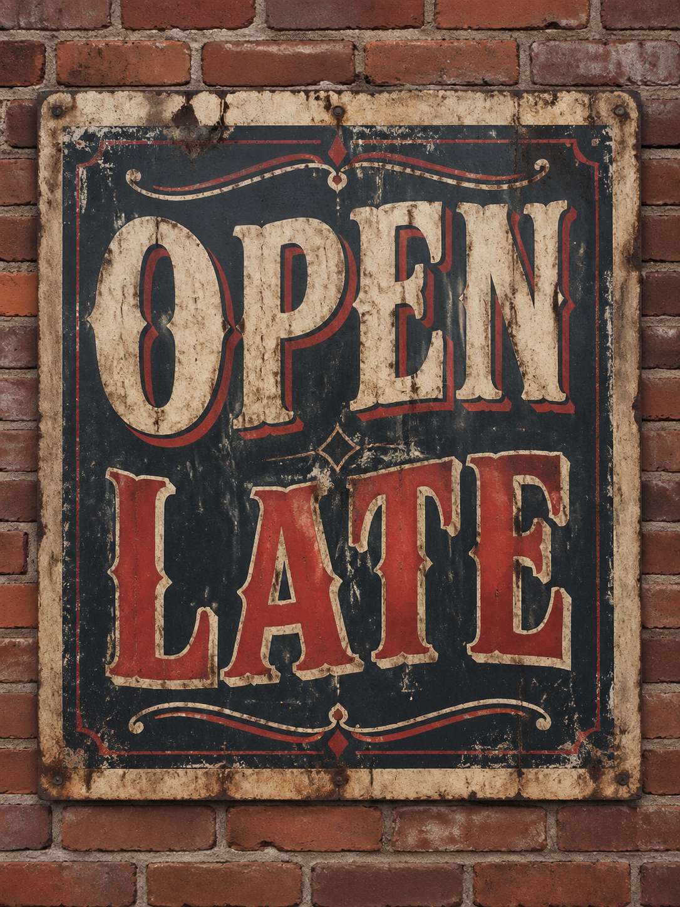
</p>

### 霓虹招牌字体

> 夜间深色砖墙上发光的霓虹招牌。文字写着 "DREAM BIG"，草书霓虹管，热粉色和电蓝色渐变。光晕轻微动态模糊。下方潮湿路面的反射。城市夜生活美学，电影感。


<p align="center">
  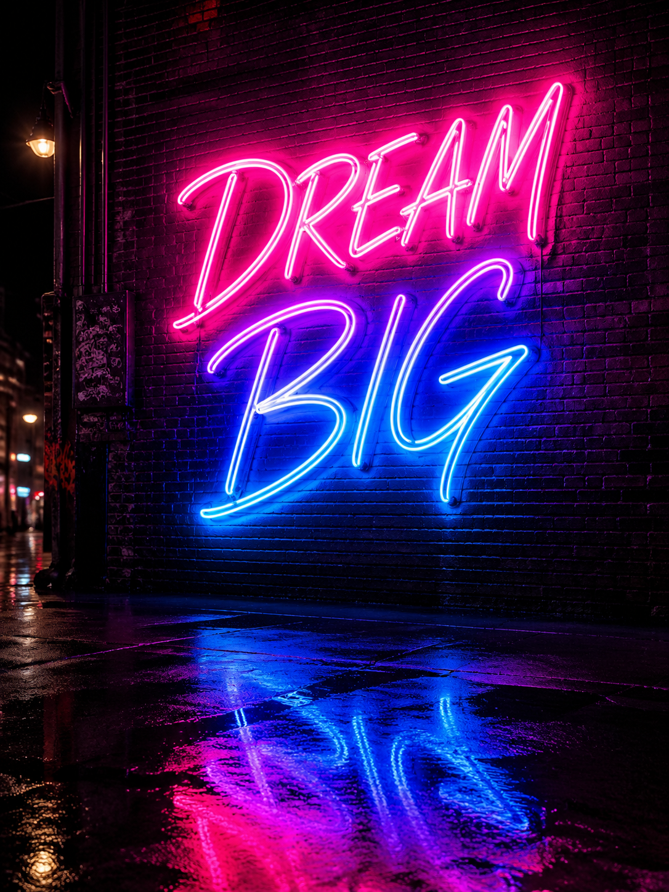
</p>

### 极简引言海报

> 有纹理的灰白色纸张背景上的极简排版海报。引言 "LESS IS MORE" 使用纤细优雅的 Helvetica Neue Light，居中。下方用小号无衬线字体："Dieter Rams, 1995。" 大量留白。瑞士设计美学，博物馆级印刷品。


<p align="center">
  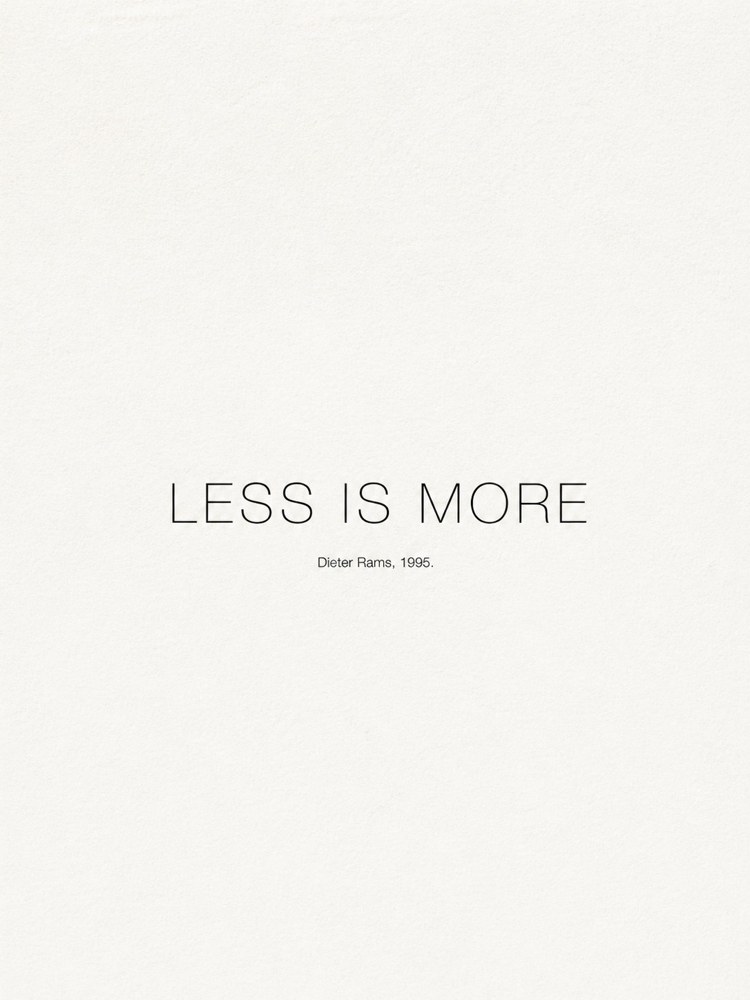
</p>

### 涂鸦字体

> 混凝土墙上的大胆涂鸦风格字体。单词 "CREATE" 使用狂野风格涂鸦 —— 复杂的箭头、3D 投影、橙色和黄色火焰填充图案。镀铬轮廓。照片级真实的墙面纹理，可见裂缝和污渍。街头艺术纪录片摄影风格。


<p align="center">
  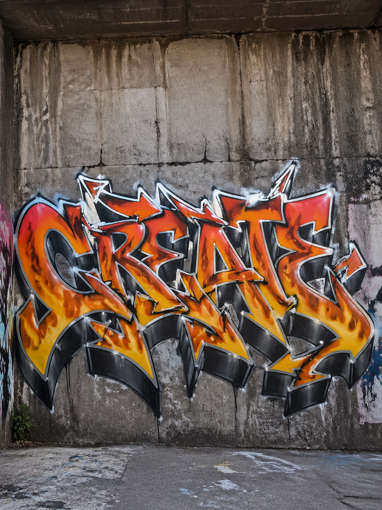
</p>

### 日式竖排书法

> 手工和纸上的传统日式竖排书法。黑色墨汁笔触形成 "和" 的汉字。左下角红色印章（hanko）。微妙的纸张纹理，边缘墨水晕染。禅意美学，博物馆藏品品质。


<p align="center">
  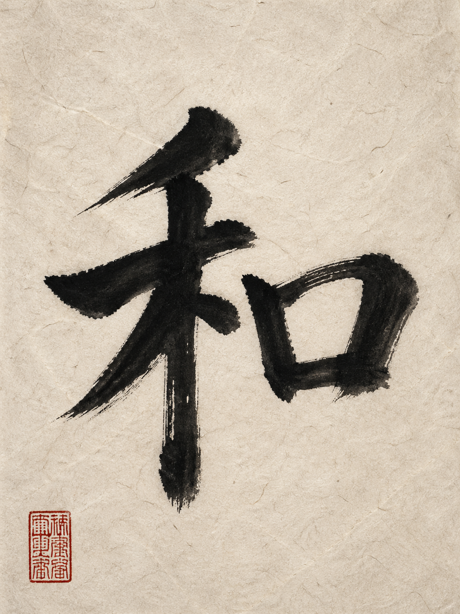
</p>

### 电影片头卡

> 电影级电影片头卡。深空背景，远处星系。标题 "EPOCH" 使用巨大的定制设计未来主义字体 —— 每个字母都是带有发光边缘的几何结构。下方副标题："A Journey Beyond Time。" 4K，史诗级规模，科幻大片美学。


<p align="center">
  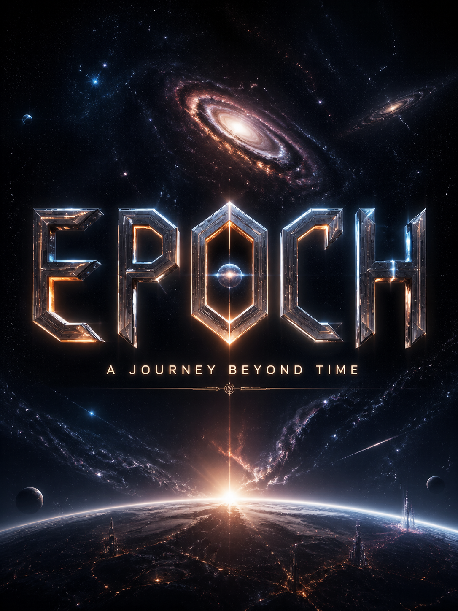
</p>
---

## 建筑与室内

### 现代客厅

> 带大落地窗俯瞰松林的下沉式客厅室内设计摄影。极简家具：奶油色圈绒沙发、混凝土壁炉、一盏宣言式落地灯。柔和傍晚光线涌入。干净线条、中性调色板、斯堪的纳维亚-日式融合美学。24mm 移轴镜头拍摄。


<p align="center">
  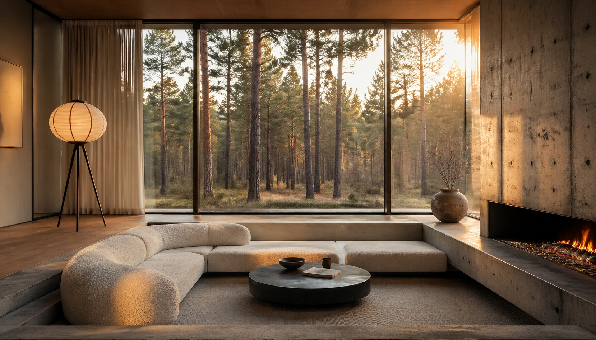
</p>

### A 型框架小屋

> 一座现代 A 型框架小屋，由烧焦木材（烧杉板）和玻璃制成， nestled 在雪景山景中。里面温暖的橙色灯光发光。蓝色时刻摄影，温暖室内与寒冷外部的强烈对比。烟囱冒烟。16mm 广角镜头拍摄。舒适、令人向往、建筑文摘品质。


<p align="center">
  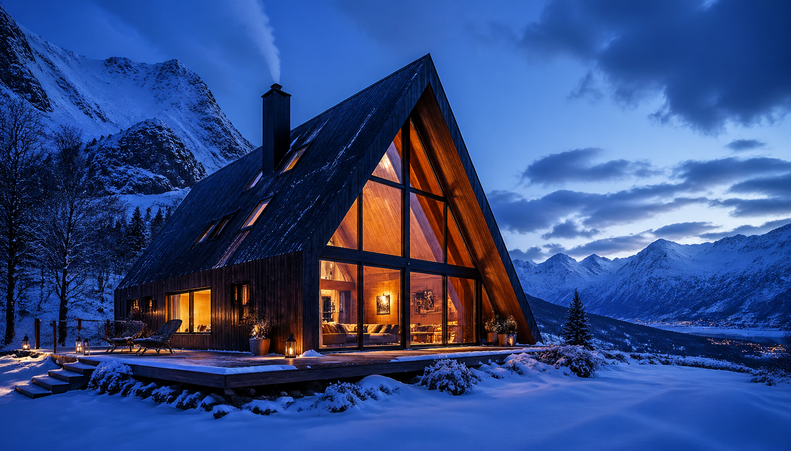
</p>

### 奢侈品精品店内景

> 带金色点缀和大理石地板的奢侈品精品店内景。设计服装整齐排列的服装架。水晶吊灯中心装饰。优雅的温暖灯光。高端建筑可视化。24mm、f/8 全图锐利拍摄。时尚零售设计美学。


<p align="center">
  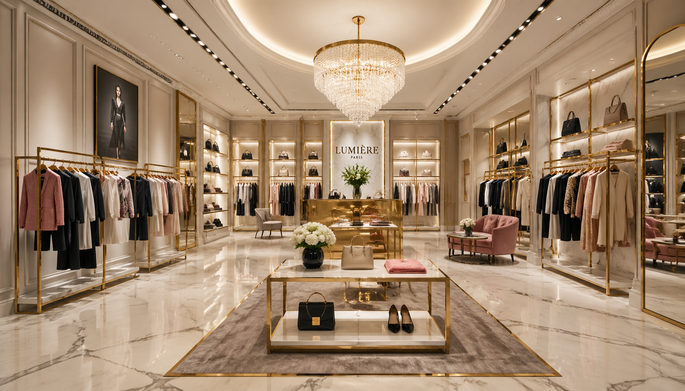
</p>

### 工业阁楼厨房

> 带裸露砖墙、钢梁天花板和再生木台面的工业阁楼厨房。大型工厂窗户让进晨光。不锈钢电器，带陶瓷餐具的开放式搁架。混凝土岛台上悬挂着单个爱迪生灯泡。温暖、有人居住、工业时尚美学。


<p align="center">
  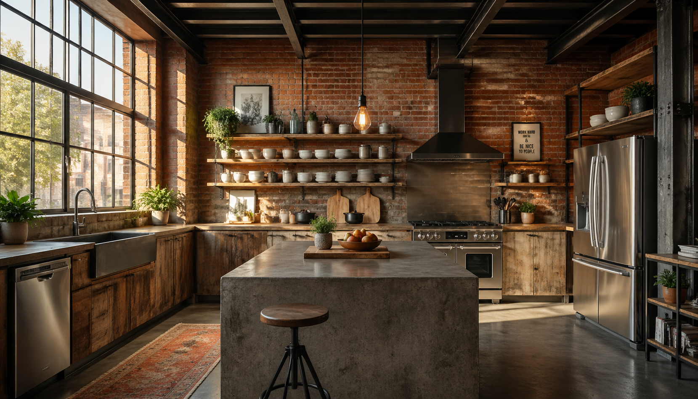
</p>

### 日式旅馆室内

> 传统日式旅馆房间室内。榻榻米垫、低矮木桌配茶具、过滤柔和自然光的障子屏风。壁龛上小花道插花。极简、宁静、温暖木色调。35mm f/2.8 拍摄。侘寂美学，宁静氛围。


<p align="center">
  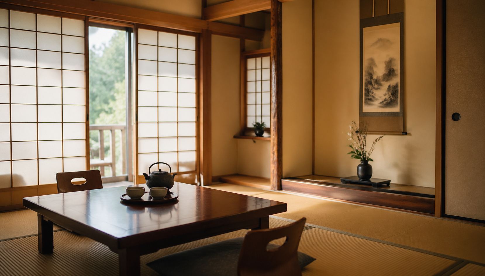
</p>

### 未来博物馆大厅

> 带弧形白色墙壁和戏剧性天窗的未来博物馆室内。一个巨大的全息艺术装置漂浮在宏伟大厅中央。反光抛光混凝土地板。几个 tiny 参观者作为比例参考。扎哈·哈迪德风格建筑。干净、宏伟、令人敬畏。


<p align="center">
  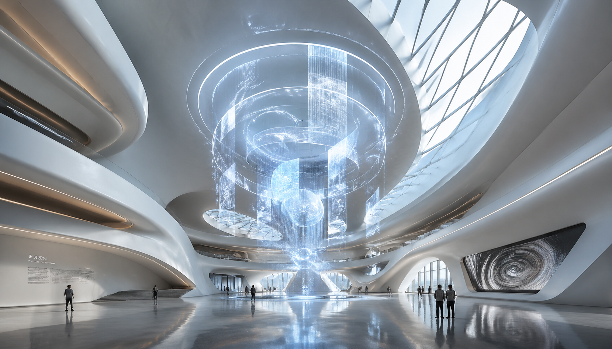
</p>
---

## 实验与趣味

### 复古 8 位风景

> 雷暴期间中世纪城堡的 sprawling 8 位像素艺术风景。紫色闪电照亮天空。最高塔上龙的剪影。复古电子游戏美学，有限调色板，抖动图案。NES 时代图形但配现代色彩理论。


<p align="center">
  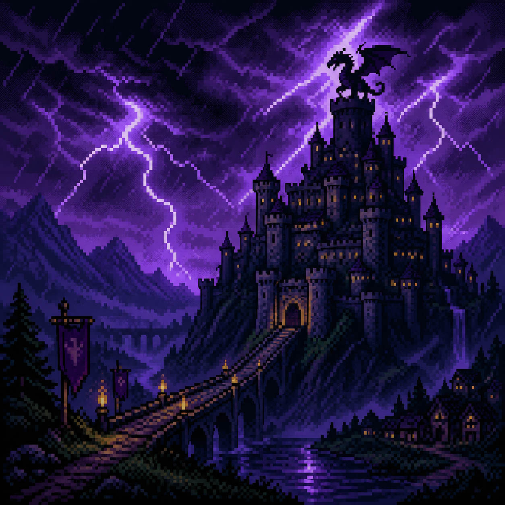
</p>

### 针织森林世界

> 完全由彩色针织羊毛制成的小森林的微距镜头。针织松鼠、鸟类和蘑菇。每棵树都是不同色调的绿色纱线。柔软、触感纹理，浅景深。温暖工作室灯光的微距摄影风格。异想天开，手工美学。


<p align="center">
  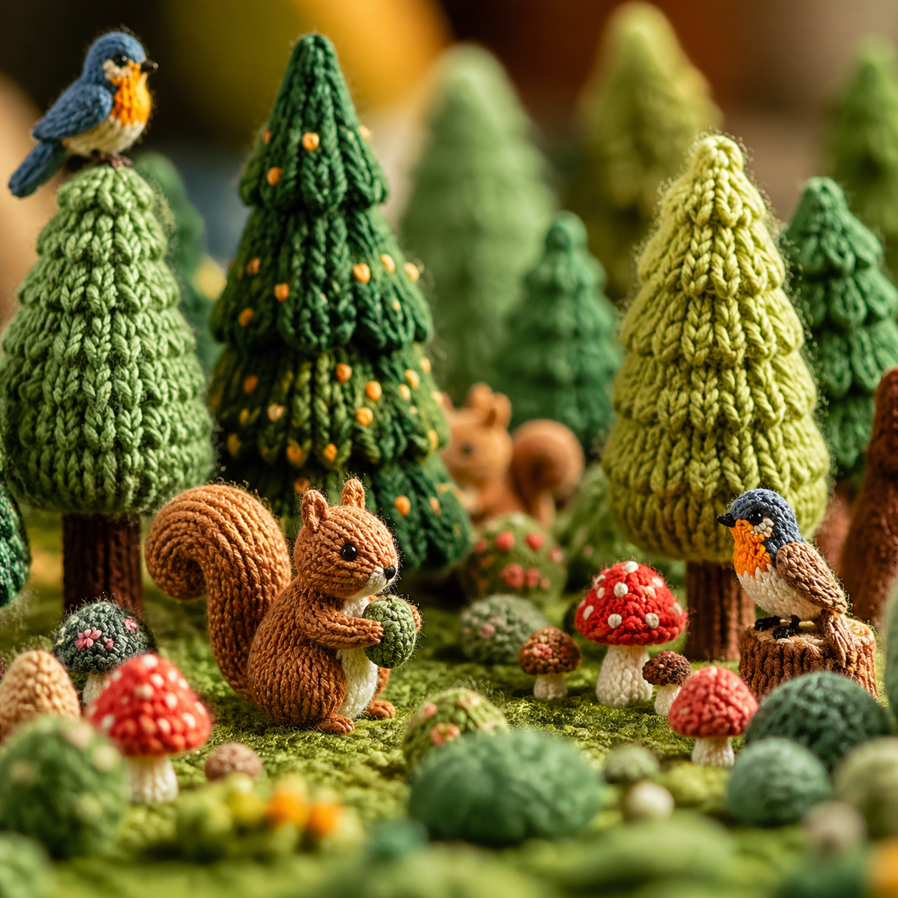
</p>

### 双重曝光人像

> 女性侧影的双重曝光。剪影内部是一片浓密的雾蒙蒙松树林，有一只翱翔的鹰。白色背景，艺术美术摄影风格。干净的边缘，完美融合的图像。梦幻、象征性、编辑艺术作品。


<p align="center">
  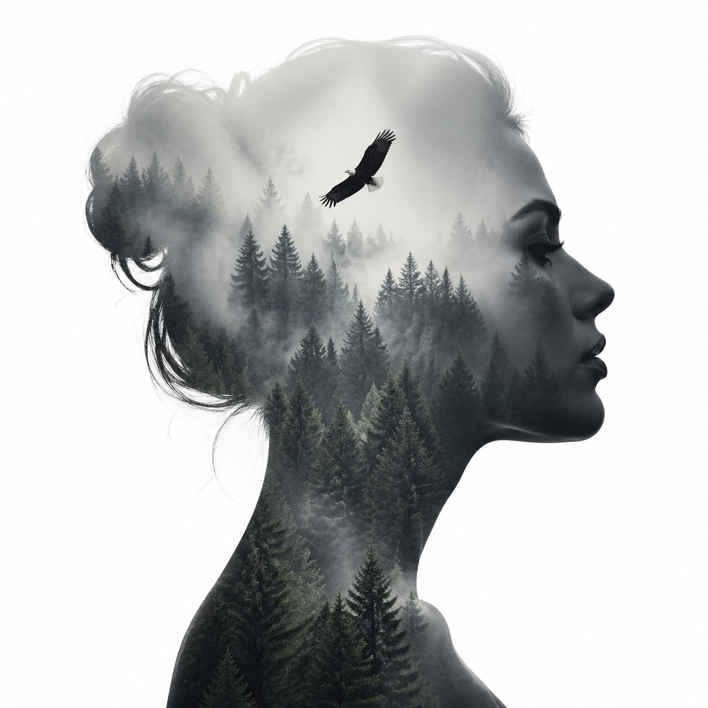
</p>

### 铅笔素描跑车

> 有纹理的奶油色绘图纸上的详细炭笔和铅笔素描，一辆 1960 年代复古保时捷 911。真实的阴影，带有晕染的石墨边缘。可见的纸张纹理和齿纹。一些构造线仍然可见。艺术家手持铅笔的手部分入框。美术素描美学。


<p align="center">
  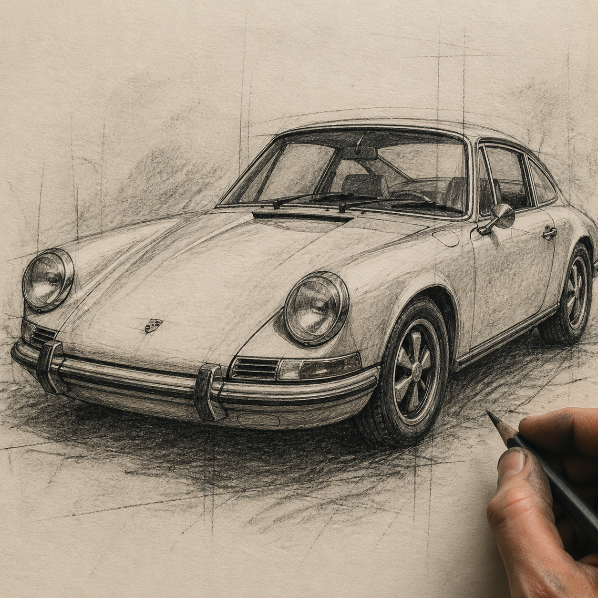
</p>

### 3D 乙烯基玩具机器人

> 一个可爱的 3D 乙烯基玩具机器人手持小花。亮 pastel 色的光泽塑料材质 —— 薄荷绿身体、粉色关节、黄色眼睛。干净白色背景的柔和工作室灯光。表面轻微瑕疵增加真实感。设计师玩具摄影，收藏品美学。


<p align="center">
  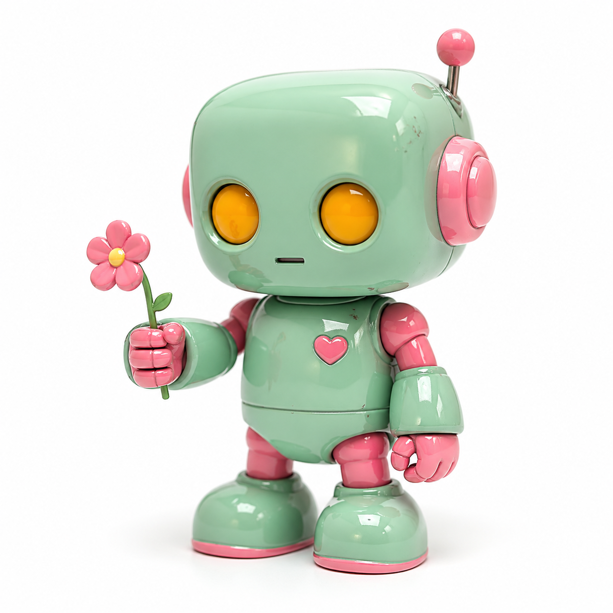
</p>

### 超现实鲸鱼云朵

> 一只巨大的座头鲸漂浮在广阔金色沙漠上方的蓬松白云海中。鲸鱼的背脊承载着一片小型翠绿森林和瀑布。玛格丽特和达利传统的超现实油画风格。鲜艳色彩，梦幻灯光，不可能的规模。


<p align="center">
  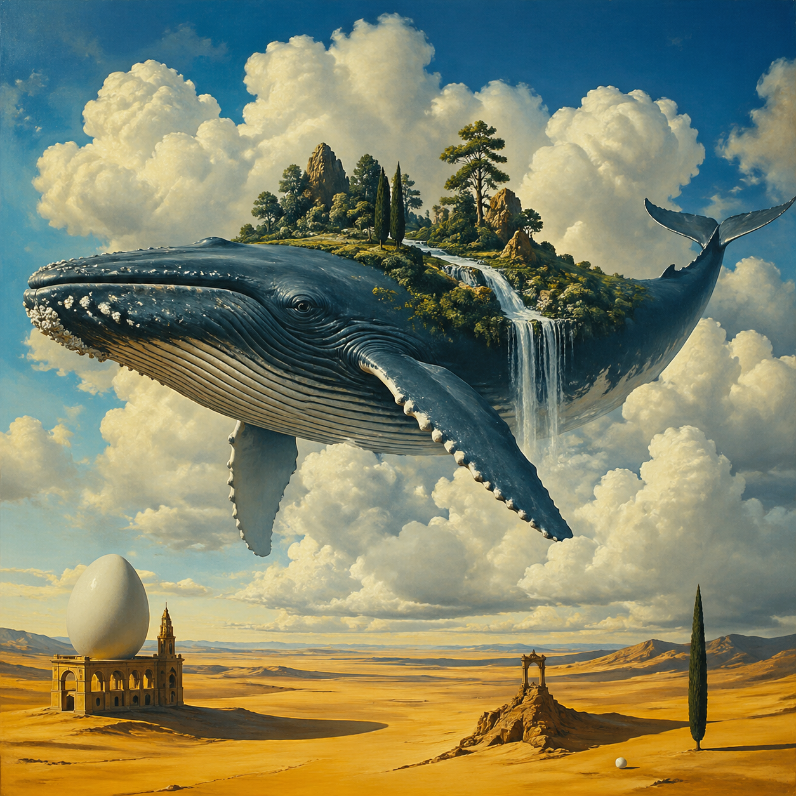
</p>
---

## 提示工程技巧

基于 GPT Image 2 的大量测试，以下是产生最佳结果的模式：

### 八要素公式

按顺序用这些要素构建你的提示词：

1. **主体** — 主要焦点是什么？（人物、产品、建筑）
2. **动作/姿势** — 他们在做什么？（站立、漂浮、奔跑）
3. **环境** — 他们在哪里？（东京街头、工作室、森林）
4. **灯光** — 如何照明？（黄金时段、伦勃朗、霓虹）
5. **相机/镜头** — 什么设备？（85mm f/1.4、24mm 广角）
6. **风格/参考** — 什么美学？（韦斯·安德森、Vogue、皮克斯）
7. **色调** — 什么调色板？（青橙、粉彩、单色）
8. **氛围/气氛** — 什么感觉？（忧郁、史诗、舒适）

### 文字准确性

GPT Image 2 在以下情况下处理文字效果极佳：
- 将文字放在**引号中**：`"OPEN LATE"` 或 `'SALE 50% OFF'`
- 指定**字体风格**："粗体无衬线" 或 "优雅草书"
- 描述**位置**："顶部居中" 或 "右下角"
- 使用**全大写强调**：`"DREAM BIG"` 比大小写混合渲染更可靠

### 风格锚点

不要使用模糊描述，使用具体参考：

| 不要写 | 要写 |
|--------|------|
| "美丽的奇幻艺术" | "Ufotable 动画工作室制作质量" |
| "专业照片" | "哈苏 H6D 拍摄，100mm 镜头 f/2.8" |
| "卡通风格" | "皮克斯 3D 渲染，电影级质量" |
| "老照片质感" | "Kodak Portra 400，35mm 胶片颗粒，漏光" |
| "暗黑忧郁" | "明暗对比灯光，深邃阴影，伦勃朗风格" |

### 品牌一致性

对于系列作品，在每个提示词后附加**项目风格块**：

```
项目风格块：
- 品牌调色板：深海蓝 #0f172a、电光青 #38bdf8、暖奶油 #fef3c7
- 字体：几何无衬线标题，粗衬线正文
- 氛围：干净、自信、略带未来感，从不幼稚
- 约束：背景中不要随机人物，不要无标题 UI 元素
```

---

## 如何贡献

欢迎社区贡献！添加提示词的方法如下：

1. **Fork 本仓库**
2. **将你的提示词** 添加到 `/prompts/` 中适当的分类文件
3. **遵循格式**：包含提示词文本、简要描述和建议的使用场景
4. **提交 Pull Request**，附带清晰的描述

### 提示词质量标准

- 提示词必须已用 GPT Image 2（或兼容模型）测试
- 包含具体技术细节（镜头、灯光、风格参考）
- 避免通用描述 —— 越具体，结果越好
- 文字元素必须使用引号以确保准确性
- 每次提交一个提示词（除非是一组/系列）

### 建议新分类

如果你的提示词不适合现有分类，请开 issue 讨论添加新分类。

---

## 由 NeoSpark 驱动

<div align="center">

### 您的 AI 智能创意团队

[NeoSpark](https://useneospark.com?ref=awesome-gpt-image-2) 让您在一个平台即时访问 **GPT Image 2** 和 7+ 其他顶级 AI 模型：

- **文字转设计** — 一键从想法到素材
- **智能配色** — AI 驱动的色彩心理学
- **电商解决方案** — 产品照片和广告视频
- **视频生成** — Veo 3、Seedance 2.0 等
- **全模型包含** — 无额外费用，即时切换

**[获取您的首个免费设计 →](https://useneospark.com?ref=awesome-gpt-image-2)**

*无需信用卡 • 2,500+ 创作者已在使用 NeoSpark*

</div>

---

## 许可证

本仓库采用 [CC BY 4.0](https://creativecommons.org/licenses/by/4.0/) 许可。

您可以：
- **分享** — 在任何媒介或格式中复制和重新分发材料
- **改编** — 重新混合、转换和基于材料进行创作，用于任何目的，包括商业用途

须满足以下条件：
- **署名** — 您必须给予适当的署名，提供许可证链接，并注明是否进行了更改

---

<div align="center">

<p>如果你觉得这个合集有帮助，请考虑 <a href="https://useneospark.com?ref=awesome-gpt-image-2">试用 NeoSpark</a> 或分享本仓库！</p>

<p>
  <a href="https://useneospark.com/prompt-lib?ref=awesome-gpt-image-2">提示词库</a> •
  <a href="https://useneospark.com/pricing?ref=awesome-gpt-image-2">定价</a> •
  <a href="https://useneospark.com/blog?ref=awesome-gpt-image-2">博客</a>
</p>

</div>
